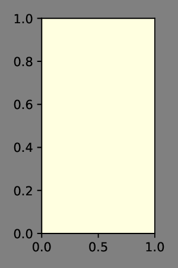
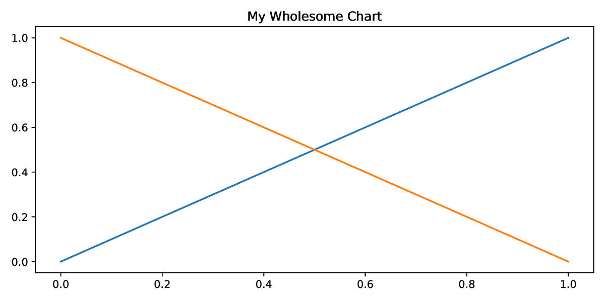
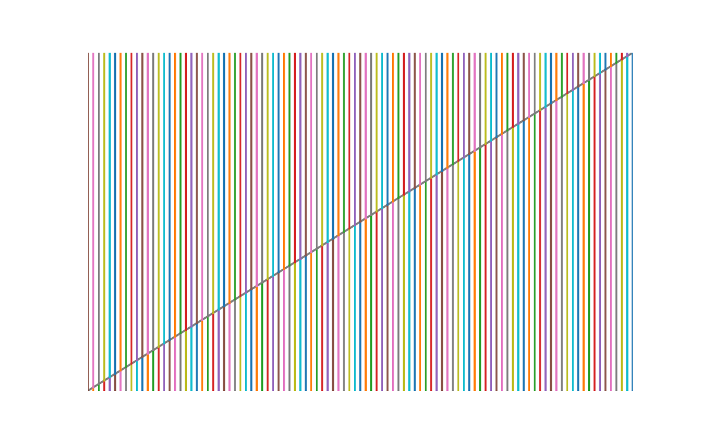
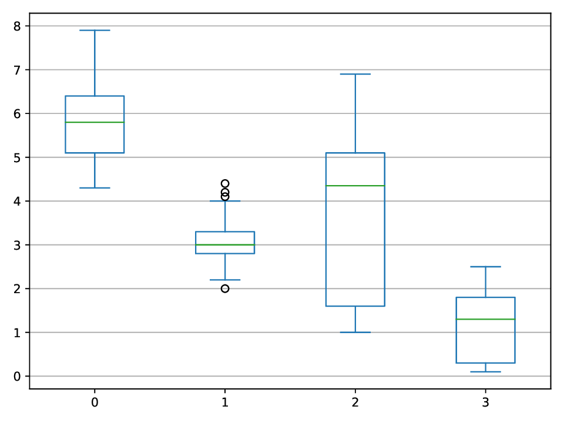

# The Object-oriented Interface

Matplotlib offers two interfaces: a MATLAB-style interface and the more cumbersome object-oriented interface. If you count yourself among the matplotlib-averse, you likely never had the stomach for object-oriented headaches. Still, we are using the object oriented interface because we can do more with this.

The MATLAB-style interface looks like the following.

```{literalinclude} ../../python/matlab-plot.py
:language: python
```

The object-oriented interface looks like this.

```{literalinclude} ../../python/oop-plot.py
:language: python
```

There is no such thing as a free lunch, so you will observe this interface requires more code to do the same exact thing. Its virtues will be more apparent later. Object-oriented programming (OOP) also requires some new vocabulary. OOP might be contrasted with procedural programming as another common method of programming. In procedural programming, the MATLAB-style interface being an example, the data and code are separate and the programmer creates procedures that operate on the program's data. OOP instead focuses on the creation of *objects* which encapsulate both data and procedures.

An object's data are called its *attributes* and the procedures or functions are called *methods*. In the previous code, we have figure and axes objects, making use of axes methods `plot()` and `set_title()`, both of which add data to the axes object in some sense, as we could extract the lines and title from `ax` with more code. Objects themselves are instances of a *class*. So `ax` is an object and an instance of the Axes class. Classes can also branch into subclasses, meaning a particular kind of object might also belong to a more general class. A deeper knowledge is beyond our scope, but this establishes enough vocabulary for us to continue building an applied knowledge of matplotlib. Because `ax` contains its data, you can think of `set_title()` as changing `ax` and this helps make sense of the `get_title()` method, which simply returns the title belonging to `ax`. Having some understanding that these objects contain both procedures and data will be helpful in starting to make sense of intimidating programs or inscrutable documentation you might come across.

## Figure, Axes

A plot requires a figure object and an axes object, typically defined as `fig` and `ax`. The figure object is the top level container. In many cases like in the above, you'll define it at the beginning of your code and never need to reference it again, as plotting is usually done with axes methods. A commonly used figure parameter is `figsize`, to which you can pass a sequence to alter the size of the figure. Both the figure and axes objects have a `facecolor` parameter which might help to illustrate the difference between the axes and figure.

```{literalinclude} ../../python/figparams.py
:language: python
```



The axes object, named `ax` by convention, gets more use in most programs. In place of `plt.plot()`, you'll use `ax.plot()`. Similarly, `plt.hist()` is replaced with `ax.hist()` to create a histogram. If you have experience with the MATLAB interface, you might get reasonably far with the object-oriented style just replacing the `plt` prefix on your pyplot functions with `ax` to see if you have an equivalent axes method.

This wishful coding won't take you everywhere though. For example, `plt.xlim()` is replaced by `ax.set_xlim()` to set the x-axis view limits. To modify the title, `plt.title()` is replaced with `ax.set_title()` and there is `ax.get_title()` simply to get the title. The axes object also happens to have a `title` attribute, which is only used to access the title, similar to the `get_title()` method. Many matplotlib methods can be classified as *getters* or *setters* like for these title methods. The plot method and its logic is different. Later calls of `ax.plot()` don't overwrite earlier calls and there is not the same getter and setter form. There's a `plot()` method but no single `plot` attribute being mutated. Whatever has been plotted can be retrieved, or gotten (getter'd?), but it's more complicated and rarely necessary. Use the code below to see what happens with two calls of `plot()` and two calls of `set_title()`. The second print statement demonstrates that the second call of `set_title()` overwrites the title attribute, but a second plot does not nullify the first.

```{literalinclude} ../../python/gettersetter.py
:language: python
```



Axes methods `set_xlim()` and `get_xlim()` behave just like `set_title()` and `get_title()`, but note there is no attribute simply accessible with `ax.xlim`, so the existence of getters and setters is the more fundamental pattern.[^1]

[^1]: Getters and setters are thought of as old-fashioned. It's more Pythonic to access attributes directly, but matplotlib doesn't yet support this.

## Mixing the Interfaces

You can also mix the interfaces. Use `plt.gca()` to *g*et the *c*urrent *a*xis. Use `plt.gcf()` to *g*et the *c*urrent *f*igure.

```{literalinclude} ../../python/chart.py
:language: python
```



In the above, we started with MATLAB and then converted to object-oriented. We can also go in the opposite direction, though it's not always ideal, especially when working with subplots. Below, we start with our figure and axes objects, and then revert back to the MATLAB style with the `axvline()` functions (producing vertical lines across the axes), toggling off the axis lines and labels, and then saving the figure. This graph would appear unchanged if you replaced `plt.axvline()` with `ax.axvline()`, `plt.axis()` with `ax.axis()`, and `fig.savefig()` would do the same as `plt.savefig()`.

```{literalinclude} ../../python/colorful.py
:language: python
```


Matplotlib is also integrated into pandas, with a `plot()` method for both Series and DataFrame objects, among other functionalities. There is excellent documentation [available](https://pandas.pydata.org/pandas-docs/stable/user_guide/visualization.html). These plots can be mixed with the object-oriented interface. You can use a plot method and specify the appropriate axes object as an argument. Below we import the iris dataset and make a boxplot with a mix of axes methods and then pyplot functions.

```{literalinclude} ../../python/irisbox.py
:language: python
```



The above capability is handy, especially with subplots, where every subplot will have its own axes object as we will see later.