# Chapter 2: Axes Appearance, Ticks, and Grids

## 2.1 Axis Aspect and Limits

The most basic plot is the empty plot.

```python
fig, ax = plt.figure(), plt.axes()
```

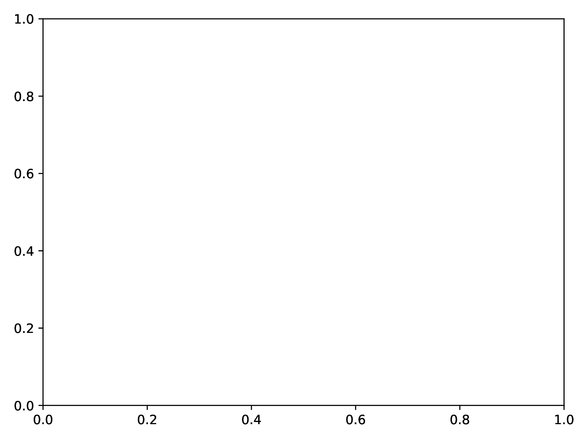

You'll notice this defaults to plotting the square region between data points (0,0) and (1,1). However, the plot is not square by default. That is to say the *aspect* is not one, where the aspect is the ratio of height to width. This can be changed with the axes method `set_aspect()`. For equal scaling, use `ax.set_aspect('equal')` or `ax.set_aspect(1)`.

```python
fig, ax = plt.figure(), plt.axes()
ax.set_aspect('equal')
```

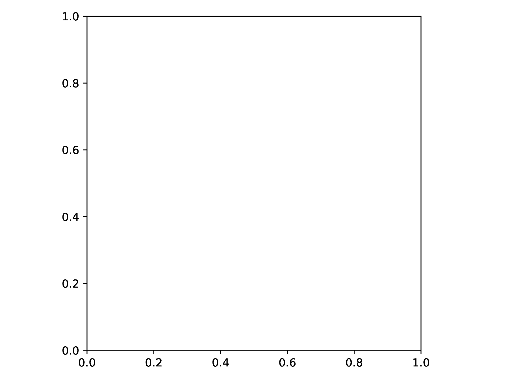

As we already covered in Chapter 1, the $x$ and $y$ limits can be adjusted with axes methods `set_xlim()` and `set_ylim()`, taking a sequence for the minimum and maximum values. If you don't explicitly set the limits, matplotlib will set the limits automatically based on the data. You can retrieve those limits with the getter methods, `get_xlim()` and `get_ylim()`.

The program below makes use of both methods. We plot a few lines, and after each plot call, matplotlib is quietly updating the axes limits. Using the `fill_between()` method, which creates a color fill in the defined region, the expanding limits are shown. The colors are chosen automatically by matplotlib because I haven't explicitly specified a color value.

```python
fig, ax = plt.figure(), plt.axes()

for i in range(1,4):
    ax.plot([0,i], [i,i])
    bottom_y, top_y = ax.get_ylim()
    left_x, right_x = ax.get_xlim()
    ax.fill_between(x = [left_x,right_x],
                    y1 = bottom_y,
                    y2 = top_y,
                    alpha = 0.5/i)

# Prevent limits from automatically stretching further
# The last fill_between would stretch limits again
ax.set_ylim(bottom_y, top_y)
ax.set_xlim(left_x, right_x)
```

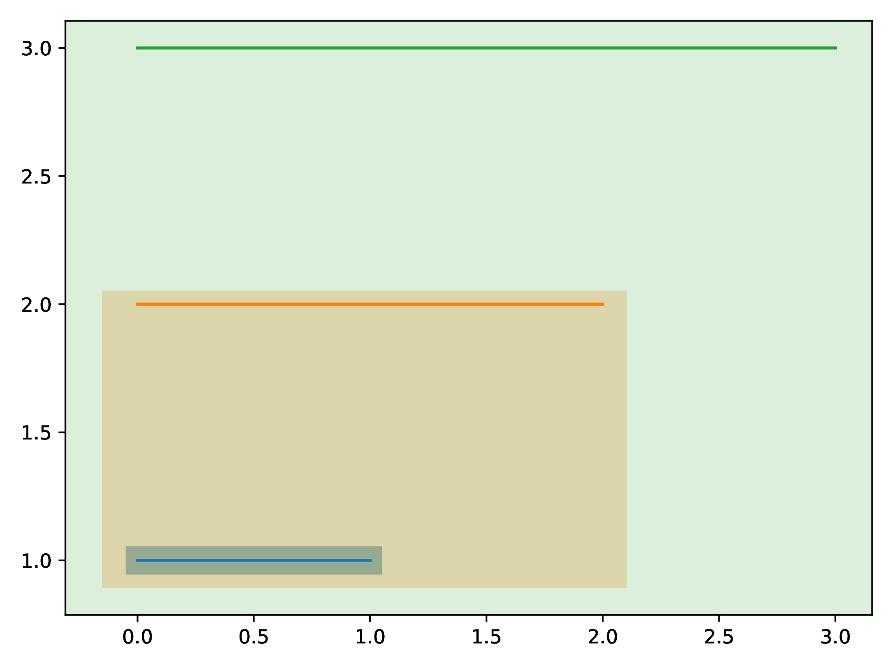

If your axes limits are too restrictive, plot elements will be cut off. If you want your plot element to break past the end of the axes, spilling into the outer figure space, you can change this by setting `clip_on = False` in the appropriate method. Below, we create two circles with `ax.plot()` and set restrictive $x$-axis limits. The first circle, in blue, would extend further to the left if the limits were more generous. By default, it is clipped so we only see half of a circle. In the next call to `ax.plot()`, we create an orange circle and toggle `clip_on = False`. As a result, the circle extends to the right of the axes limits into the remaining figure space.

```python
fig, ax = plt.figure(), plt.axes()
ax.set_aspect(1)

# Create a unit circle
u = np.linspace(0,2*np.pi,100)
x = np.cos(u)
y = np.sin(u)

# Default, clip_on = True
ax.plot(x-1, y)

# Unclipped, extends beyond the axes
ax.plot(x+1, y, clip_on = False)

ax.set_xlim(-1,1)
```

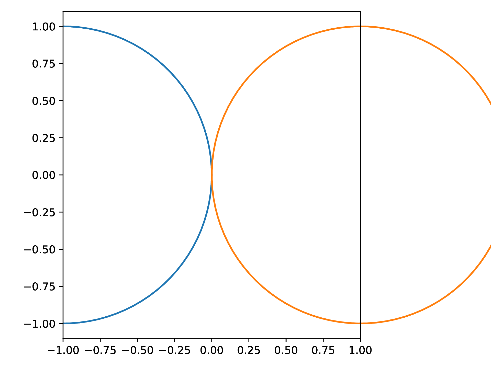

## 2.2 Axis Lines and Spines

You might be used to plots that aren't surrounded by a box. Those enclosing lines, included by default, are called the *spines*. The default might also be jarring if you're used to the typical $x$- and $y$-axis lines at $y=0$ and $x=0$, like in most math textbook plots. In this section we'll cover how to modify these.

First, you might just eliminate everything with `ax.axis('off')`. We saw `plt.axis('off')` used similarly in Chapter 1 with a program that alternated between pyplot functions and the object-oriented approach. Below is a simple plot, empty but for a title, that becomes even emptier by eliminating the axis lines and labels. For reference, on the right is the same plot if `ax.axis('off')` were excluded from the program.

```python
fig, ax = plt.figure(), plt.axes()
ax.set_title("Where did everyone go?")
ax.axis('off')
```

 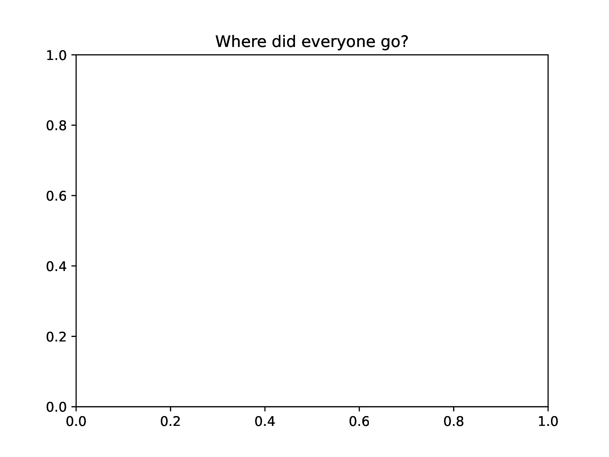

Next, we can access and modify specific spines through `ax.spines`, which returns an `OrderedDict`. Access a specific spine using the appropriate key: `"left"`, `"right"`, `"top"`, or `"bottom"`.
A spine can be toggled on or off by passing the appropriate boolean value to `set_visible()`.

```python
for spine in 'bottom', 'top', 'left', 'right':
    fig, ax = plt.figure(), plt.axes()
    ax.set_title("No " + spine.title() + " Spine")
    ax.spines[spine].set_visible(False)
    plt.show()
```

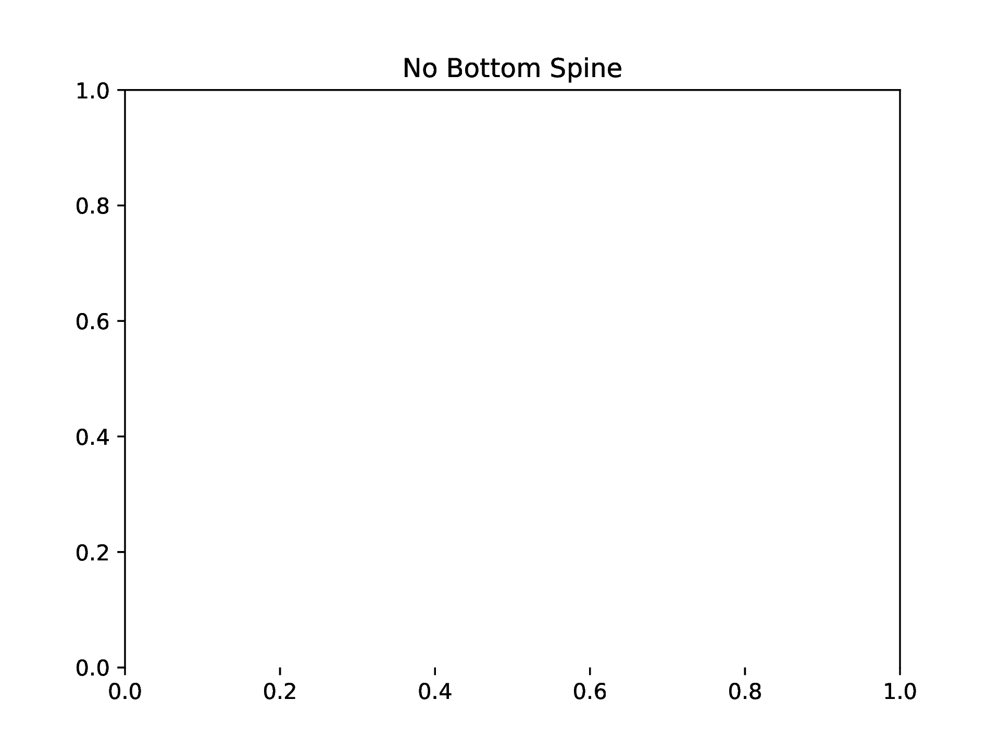 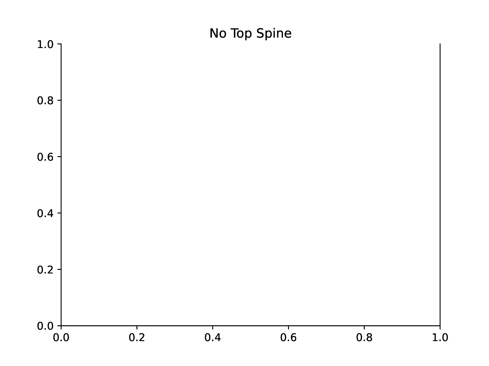
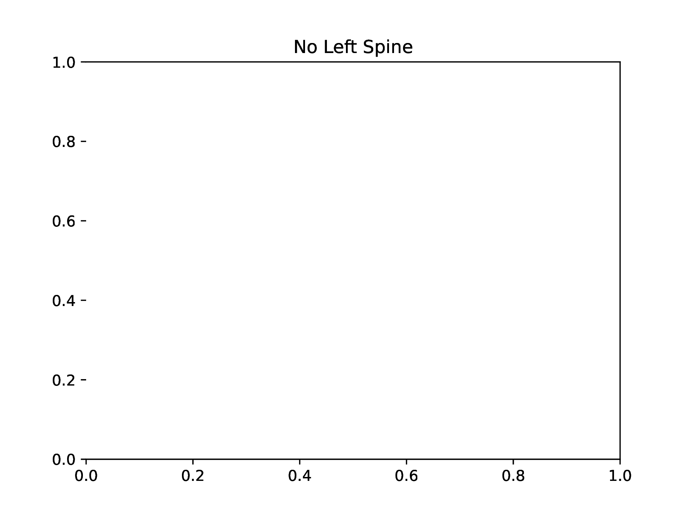 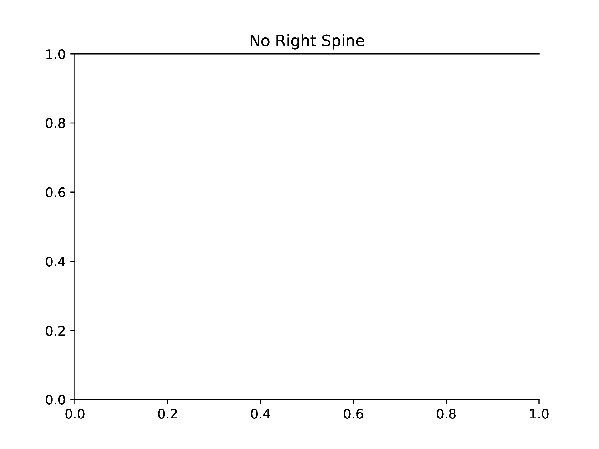

Other spine modifications might be their width and color. Again, we access a particular spine and then make use of setter methods, `set_color` and `set_linewidth` in particular.

```python
fig, ax = plt.figure(), plt.axes(facecolor = 'lightyellow')
ax.set_title("Thick Spines")
for spine in 'bottom', 'top', 'left', 'right':
    ax.spines[spine].set_color('black')
    ax.spines[spine].set_linewidth(4)
ax.set_xlim(0,1)
ax.set_ylim(0,1)
```

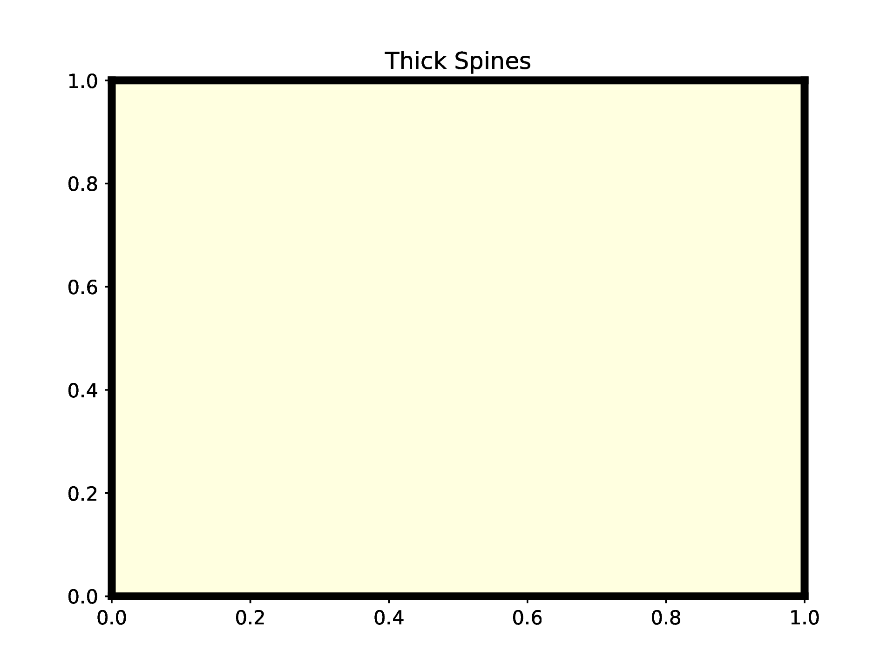

It's easy to get this far imagining that spines are simply the pieces of the box enclosing your plot. But they don't have to enclose the plot if we alter them with the `set_position` method. Below, we set the bottom spine to be along the usual $x$-axis and the left spine to be along the usual $y$-axis by passing `'zero'` to `set_position`. The right and top spines are removed.

```python
fig, ax = plt.figure(), plt.axes()
ax.set_title("Zero Spines")
ax.plot([-1,1], [-1,1])
for spine in 'top',  'right':
    ax.spines[spine].set_visible(False)
for spine in 'bottom',  'left':
    ax.spines[spine].set_position('zero')
```

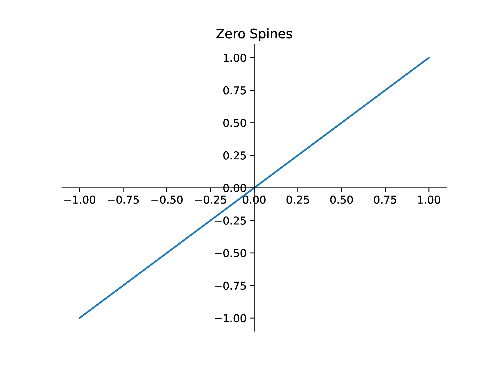

We can go a step further and add arrows at the ends of our axis lines with some clever plotting.

```python
fig, ax = plt.figure(), plt.axes()
ax.set_title("Zero Spines and Arrows")
ax.plot([-1,1], [-1,1])
for spine in 'top',  'right':
    ax.spines[spine].set_visible(False)
for spine in 'bottom',  'left':
    ax.spines[spine].set_position('zero')

# get current limits
xlims = ax.get_xlim()
ylims = ax.get_ylim()

# Add arrows
ax.plot(xlims[1], 0, ">k", clip_on = False)
ax.plot(0, ylims[1], "^k", clip_on = False)

# revert limits to before the arrows
ax.set_xlim(xlims)
ax.set_ylim(ylims)
```

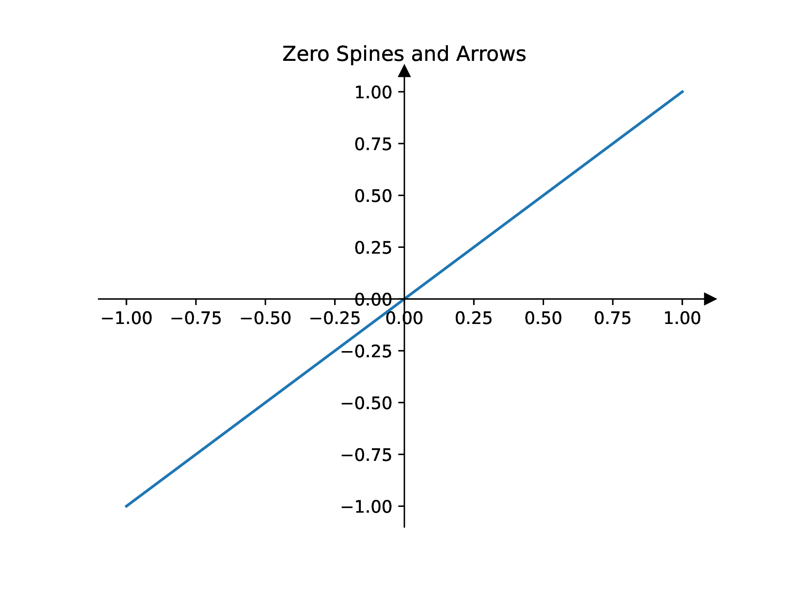

The tick labels do clutter the graph above. This can be solved after we cover Section 2.3. Knaflic (2015) recommends removing the top and right spines as part of the imperative to declutter and remove unnecessary chart border. I think it is arguable. I'm used to default spines enclosing the data. Removing them can seem untidy, like the plot guts might spill out onto the page, or as if the plot is now vulnerable to intruders without any fencing. Arrows on axis lines subtly prod the reader to imagine what happens outside of the plotted region. I don't like that if, for example, I don't want to create the impression that a linear trend in a time series graph will continue into the future.

## 2.3 Ticks

The important axes methods for ticks are `set_xticks`, `set_xticklabels`, and the natural $y$-axis counterparts. One may also use the general `set_ticks` and `set_ticklabels` with `ax.xaxis` or `ax.yaxis`—as axis (not axes) methods. These are demonstrated below, taking an array of tick locations and then the corresponding labels. I use LaTeX strings to label the ticks. Here, that allows for a prettier $y$-axis, using fractions instead of decimals for tick labels. And on the $x$-axis, we can give a proper label of $\pi$ at $x = \pi$.

```python
x = np.linspace(0, np.pi * 2, 100)

fig, ax = plt.figure(), plt.axes()
ax.plot(x, np.sin(x))

# Y axis
ax.set_yticks( [-0.5, 0, 0.5] )
ax.set_yticklabels( [r"$-\frac{1}{2}$", 0,  r"$\frac{1}{2}$"] )

# X axis
ax.xaxis.set_ticks([np.pi])
ax.xaxis.set_ticklabels([r"$\pi$"])
```

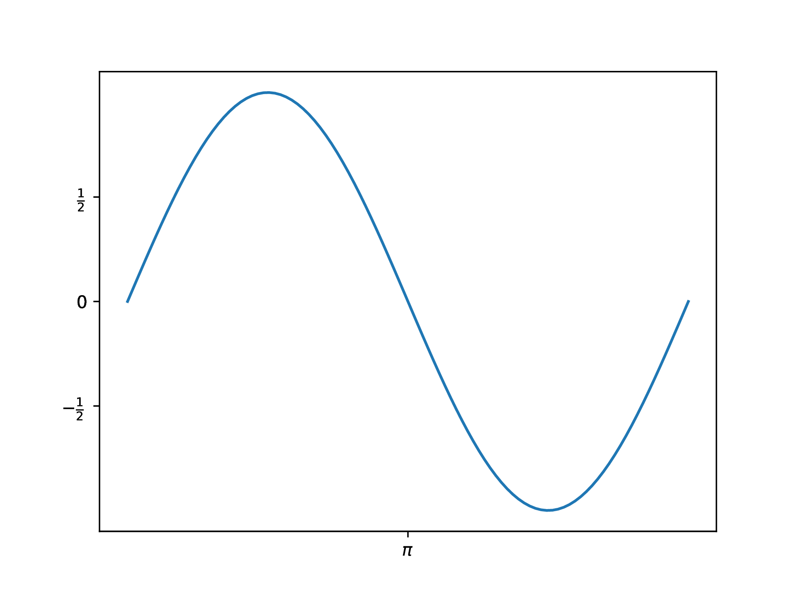

To remove the ticks entirely, simply pass an empty array to `set_ticks()`. To customize the appearance of your axis ticks and the labels, use the `set_tick_params` axis method. Parameters include `direction`, `width`, `length`, `color`, `pad`, `rotation`, `labelsize`, `labelcolor`.

Imagine a measuring ruler, with ticks for every inch and smaller ticks at smaller intervals. So far our ticks have lacked that level of depth, but in fact we can work with two tick levels in matplotlib, major and minor ticks. Minor ticks are not shown by default.

To start exploring these further customizations, you'll need to import additional formatters and or locators. For the below, you must import `MultipleLocator`, running `from matplotlib.ticker import MultipleLocator`.

```python
from matplotlib.ticker import MultipleLocator

heights = pd.Series( {'Shaq': 7 + (1/12),
                     'Yao Ming': 7.5,
                     'Delle Donne': 6 + (5/12)})

fig, ax = plt.figure(figsize = (4,7)), plt.axes()

heights.plot.bar(ax = ax,
        color = ['#FDB927', '#BA0C2F', '#0C2340'],
        edgecolor = ['#552583', '#041E42', '#C8102E'],
        linewidth = 2)
# https://teamcolorcodes.com/
# LA Lakers and Houston Rockets and DC Mystics

# Get rid of ticks on x-axis, rotate text
ax.xaxis.set_tick_params(length = 0, which = 'major',
                         rotation = 0)

ylim0, ylim1 = 0,8
ax.set_ylim([ylim0, ylim1])

ax.set_yticks(range(ylim0, ylim1+1))
#ax.yaxis.set_major_locator(MultipleLocator(1))

ax.yaxis.set_minor_locator(MultipleLocator(1/12))
ax.yaxis.set_tick_params(length = 1, which = 'minor')
ax.yaxis.set_tick_params(length = 2, which = 'major')

ax.set_ylabel("Height (feet)")
ax.set_title("Pro Basketball Players are Tall")
```

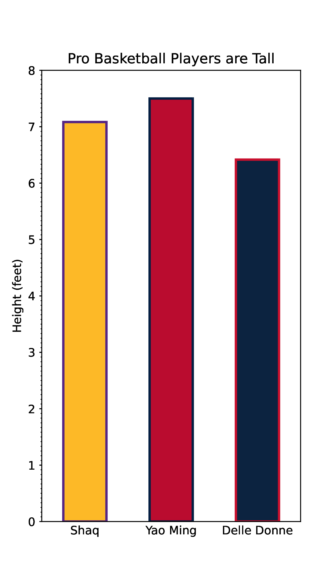

Major ticks can easily be set with `set_ticks` and its variants. Still, `MultipleLocator` and other locators are useful for setting major ticks without fooling with the details of the axes limits.

With a function like $\sin x$, ticks might most naturally be placed at multiples of $\pi$. This can be accomplished by the below.

```python
from matplotlib.ticker import MultipleLocator

x = np.linspace(0, np.pi * 2, 100)

fig, ax = plt.figure(), plt.axes()
ax.plot(x, np.sin(x))

ax.xaxis.set_major_locator(MultipleLocator(np.pi))
```

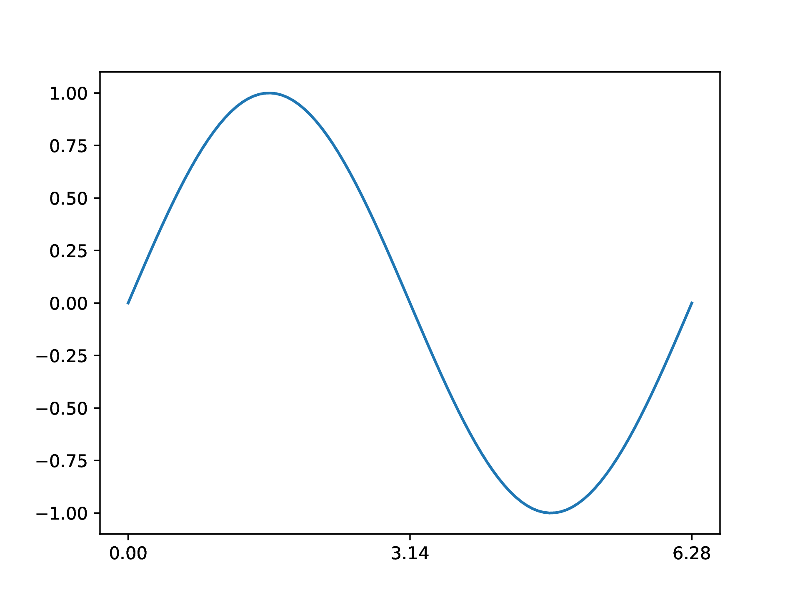

It's true you could avoid the complication of locator classes by just using `ax.set_xticks([0, np.pi, 2*np.pi])`. For a plot this simple, do that. Suppose, you put ticks up to $3\pi$ though. Then you've extended the $x$-axis limit of the plot past your data. So you need to know your data to make the right tick adjustments by hand. If you'll be using the same code with different datasets, it'll be easier to use the details-free `MultipleLocator` and you can still rely on limit defaults or adjust them independently.

Next, you might want to change the positioning of the ticks. By default $x$-axis ticks are on the bottom and $y$-axis ticks are on the left. You can modify these positions with axis methods. In time series data, for example, you might prefer to have the $y$-axis ticks on the right. Time marches on to the right and placing your ticks on the right can help emphasize that movement. This can be done with `set_ticks_position('right')` or the more concise `tick_right()`. The latter also accepts arguments of `'left'`, `'bottom'`, and `'top'`. Each has an abbreviated method like `tick_left()`.

```python
fig, ax = plt.figure(), plt.axes()
x = np.arange(10, 30, 1)
y = np.random.normal(size = len(x))
ax.plot(x,y)

# set what ticks are shown
ax.xaxis.set_ticks(x)

# move the ticks
ax.yaxis.tick_right()
ax.xaxis.set_ticks_position('top')

ax.set_title("Some Plot")
```

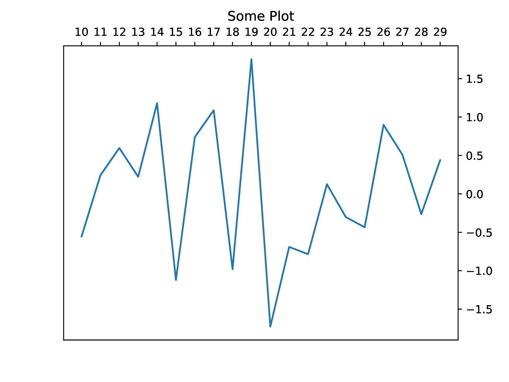

## 2.4 Grids

Including gridlines in a plot is generally discouraged (Knaflic 2015, Schwabish 2021). It's clutter that won't spark joy. Perhaps we could stop here, with the instruction to run `ax.grid(False)` as in the code below (or rely on a style, like the default, that does this automatically).

```python
fig, ax = plt.figure(), plt.axes()
x = np.linspace(0,10,100)
ax.plot(x, np.cos(x)**3)
ax.grid(False)
```

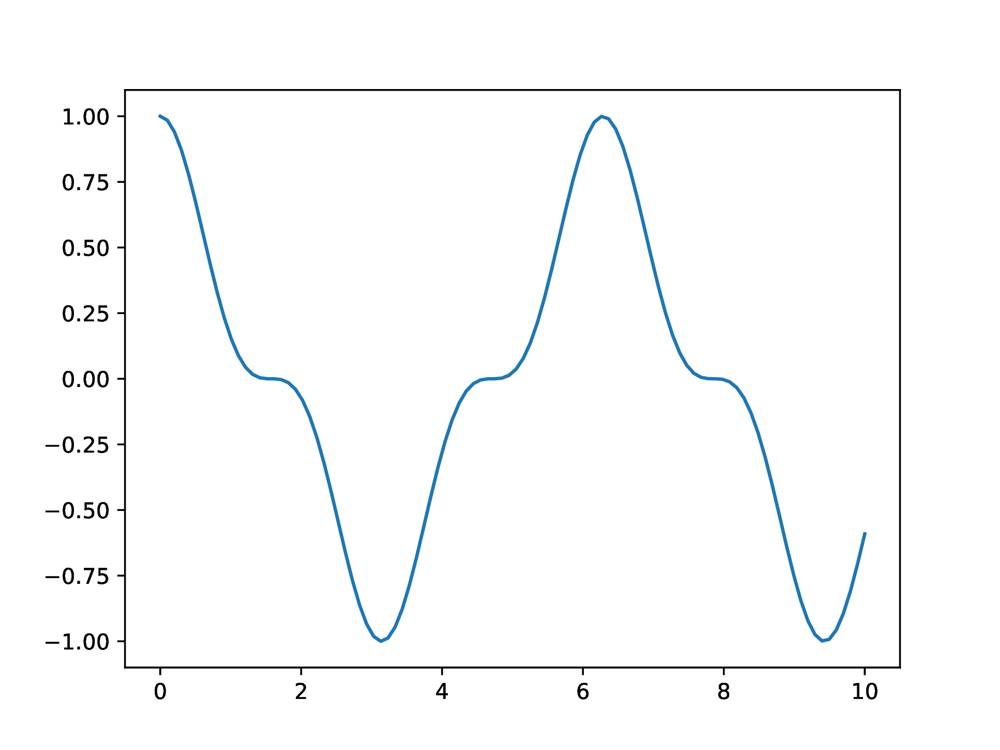

This does seem preferable to the following, but it's hardly an abomination.

```python
fig, ax = plt.figure(), plt.axes()
x = np.linspace(0,10,100)
ax.plot(x, np.cos(x)**3)
ax.grid(True)
```

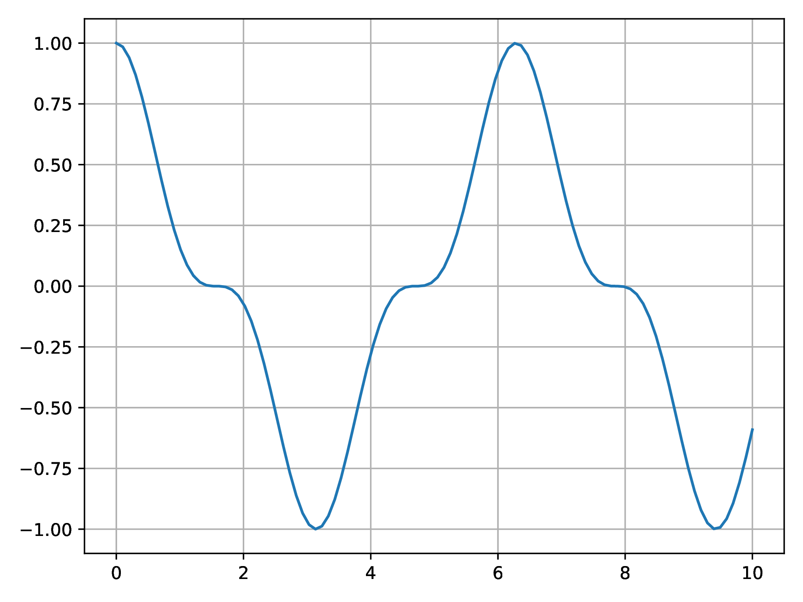

As a compromise, you might include gridlines for a single axis. If you want to emphasize that there is a slight trend in the data, then $y$-axis gridlines can help bring that pattern to the eye. Below we plot plots with and without a line of best fit and gridlines. Axis gridlines can be toggled independently by using `ax.xaxis.grid()` and `ax.yaxis.grid()`.

```python
fig, ax = plt.figure(), plt.axes()

x = np.linspace(0, 10, 100)
y = 10 + .2*x
points = y + np.random.normal(size = len(x))
ax.scatter(x,points)

ax.set_ylim(0,30)
ax.set_xticks([])
```

```python
fig, ax = plt.figure(), plt.axes()

x = np.linspace(0,10, 100)
y = 10 + .2*x
points = y + np.random.normal(size = len(x))
ax.scatter(x,points)

ax.set_ylim(0,30)
ax.set_xticks([])

# Add grid and line of best fit
ax.yaxis.grid(True)
ax.plot(x, y, color = 'black')
```

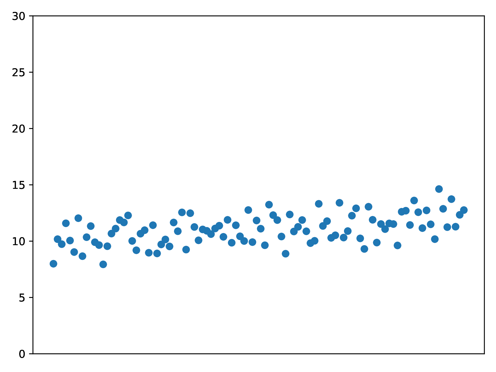 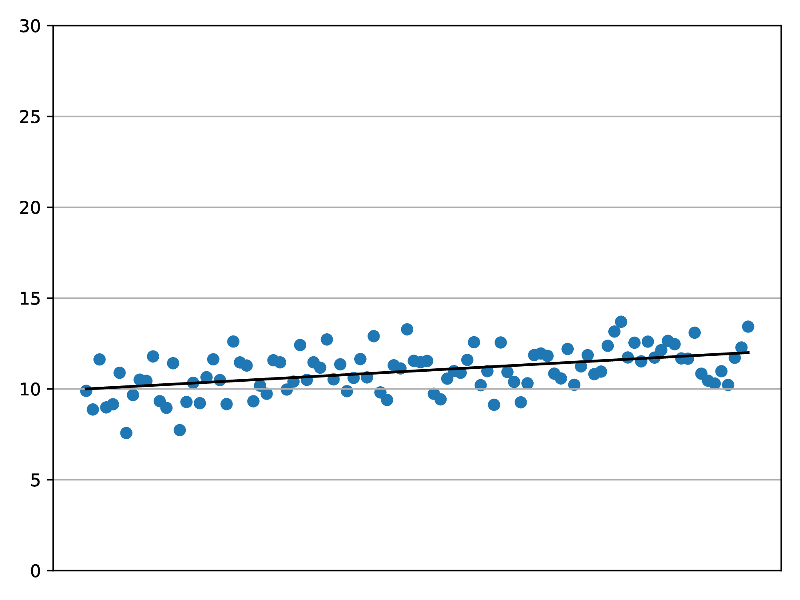

What we learned previously about locating ticks in Section 2.3 can be reapplied here, as seen in the examples further below. The location of gridlines and ticks can be set by the `set_major_locator()` and `set_minor_locator()` methods. `ax.grid()` is used to display the gridlines, but note it features a parameter `which`. The default value of `which` is `'major'`. To include minor gridlines, those minor ticks must be explicitly created (at least in the default style) and then the gridlines must be toggled on with `ax.grid(True, which = 'minor')` or for a single axis with `ax.xaxis.grid(True, which = 'minor')` for example.

```python
import matplotlib as mpl

fig, ax = plt.figure(), plt.axes()
ax.xaxis.grid(False)
ax.yaxis.grid(True, linewidth = 3)
ax.yaxis.grid(True, which = 'minor', linewidth = 0.5)
ax.yaxis.set_minor_locator(mpl.ticker.AutoMinorLocator())
```

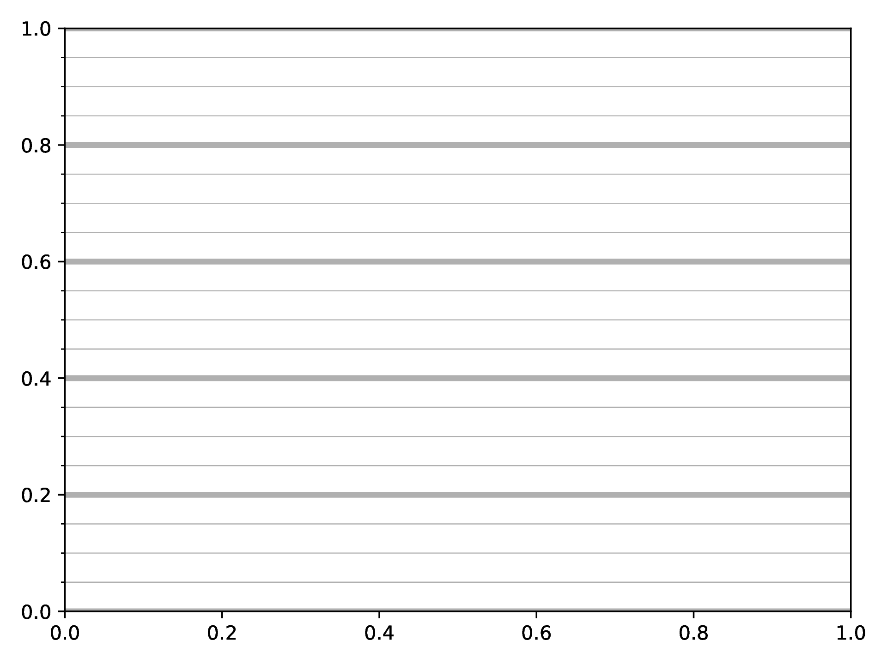

```python
import matplotlib as mpl

fig, ax = plt.figure(), plt.axes()
ax.xaxis.grid(False)
ax.yaxis.grid(True, linewidth = 3)
ax.yaxis.grid(True, which = 'minor', linewidth = 0.5)
ax.yaxis.set_minor_locator(mpl.ticker.MultipleLocator(.1))
```

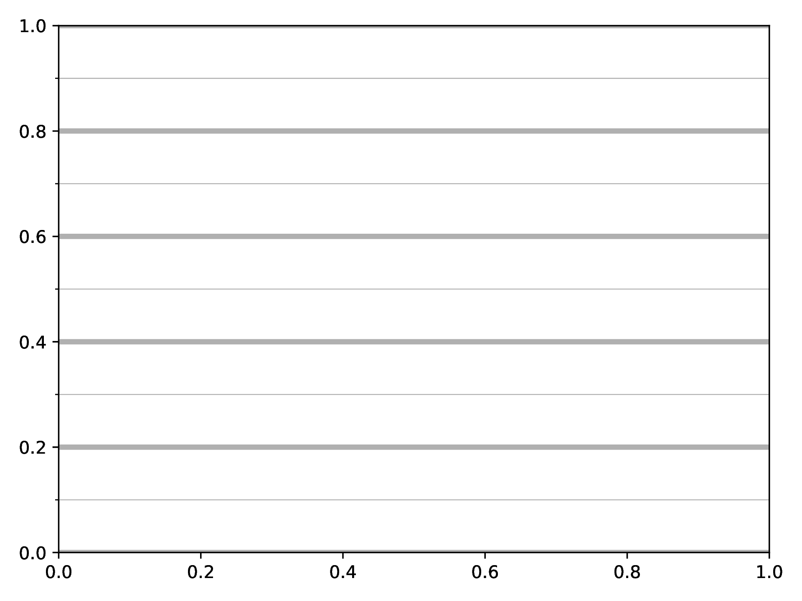