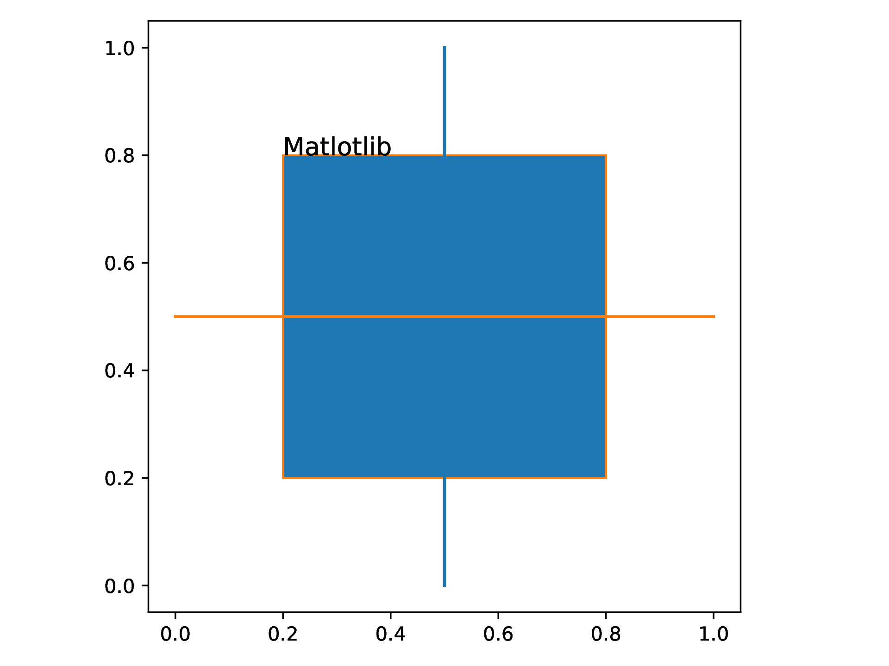
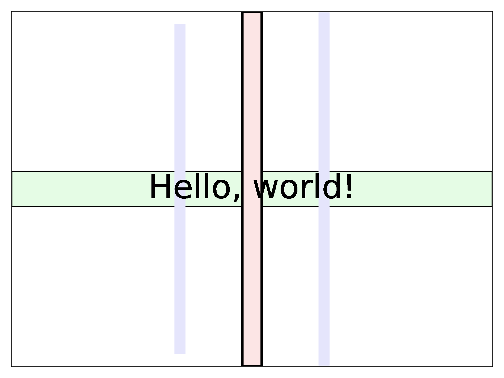
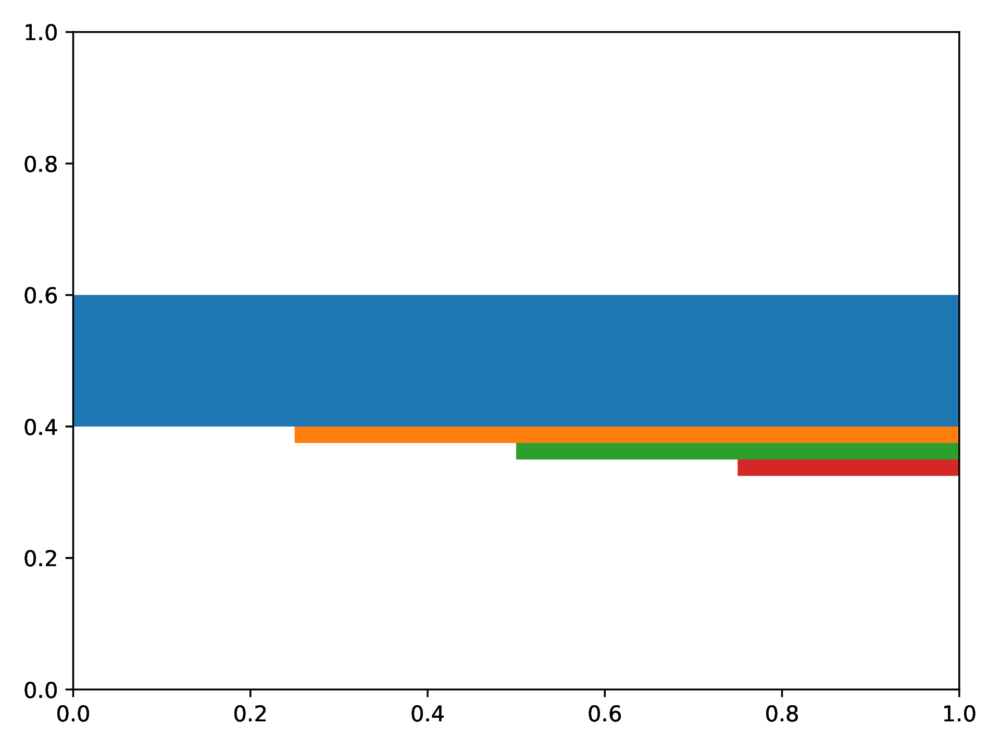
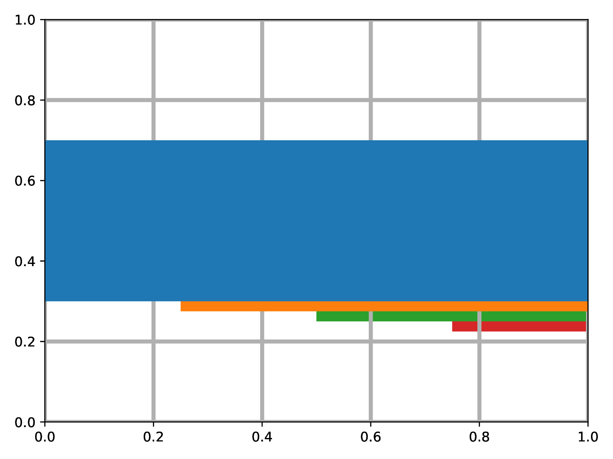
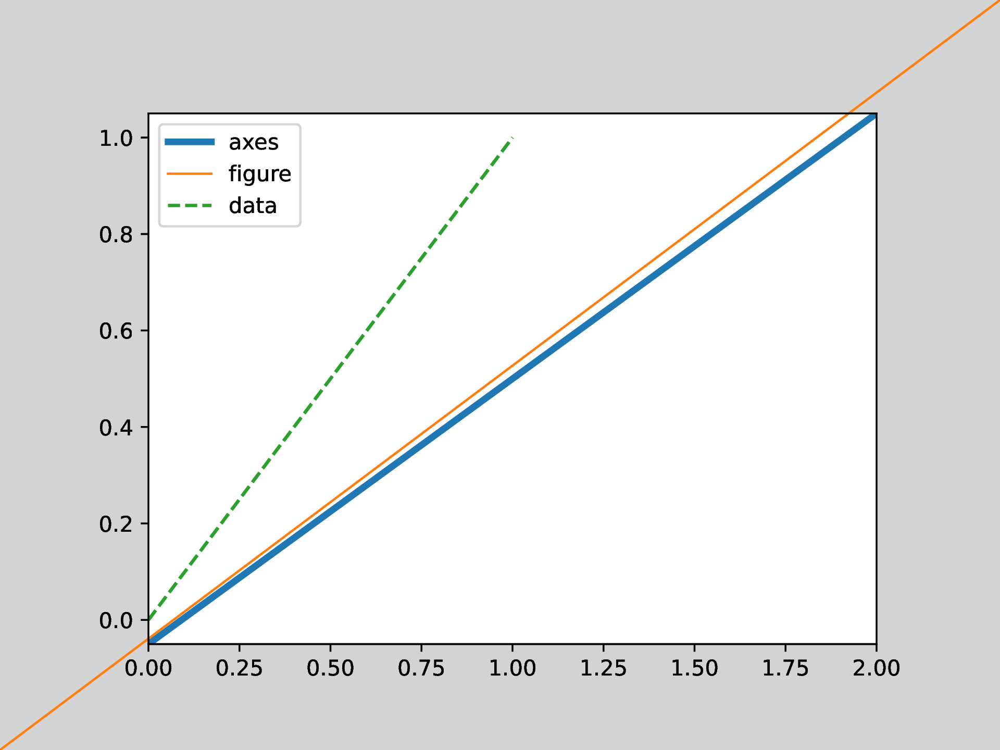
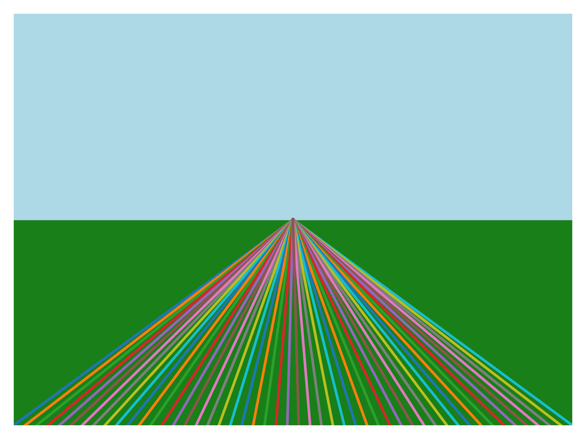
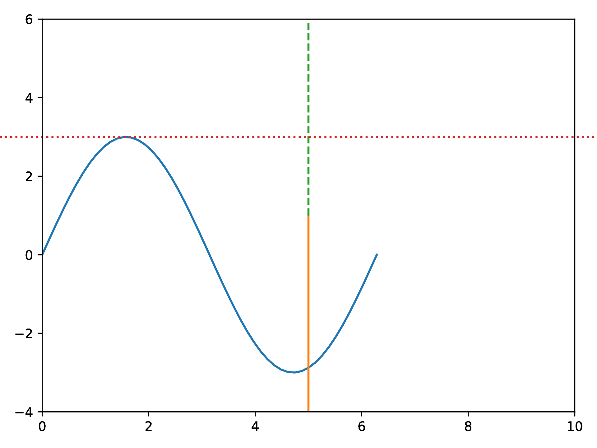
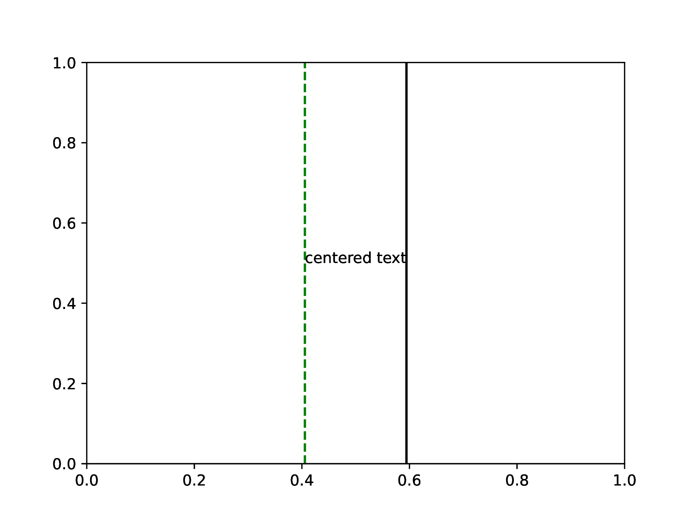
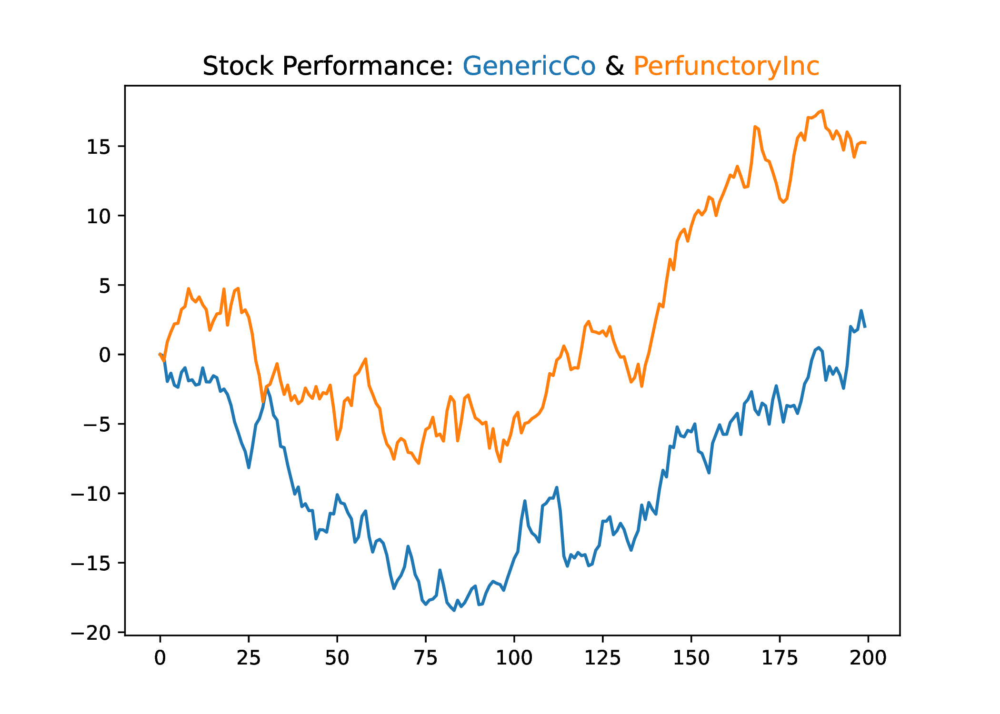

# Chapter 3: Plot Elements and Coordinate Systems

This chapter can be skipped by the reader in a hurry. I include it to establish some vocabulary about the basic plot elements and then discuss the different coordinate systems that can be used within a single plot—not polar vs. Cartesian coordinates but data coordinates vs. figure coordinates, for example. Coordinate systems do come up repeatedly in future chapters.

## 3.1 Primitives and Containers

Once you have a your figure and axis objects, you'll want to add actual plot elements to them, lines for a line chart, bars for a bar chart, annotations, etc. We already did that in Chapter 1, creating line plots. In matplotlib, these elements belong to the Artist class, it being a very general base class. Artists objects are basically the water you've been swimming in this whole time—you just might not have noticed it. Artist objects can be either primitives or containers. Containers include background items like the figure and axes objects. Primitives are the meat of the plot, like the line created by a call to `ax.plot()`. Important primitive Artist objects include Line2D, Patches, and Text.

```{literalinclude} ../../python/artists.py
:language: python
```



What might be unusual in the above is that we don't simply run `ax.plot(x, y)`. Instead we actually assign the plot call to a variable, `line, = ax.plot(x,y)`. Usually, this isn't necessary, but this allows us to reference the same object later in the program. The plot method creates a tuple of Line2D objects. In this case, that tuple contains only one item and it is assigned to the variable `line`.

Now that we have the object as `line`, we can get properties or make changes. You can obtain the color with the `get_color()` method or change it with `set_color()`. You can even remove the plot element with `line.remove()`. These are all niche uses. However, we will later make use of `remove()` when iteratively centering text. We'll also use the `get_window_extent()` artist method frequently to help space objects in the plot.

### 3.1.1 Ordering with `zorder`

#### Default Ordering

By default, text is plotted over lines and lines are plotted over patches, like the fill created by `fill_between()`. Within each of these three categories, objects created later in the program are plotted over previously created objects. The `zorder` parameter can be used to create a different ordering. Objects with a greater `zorder` value are ordered further to the front.

First, we create and plot without specifying the `zorder` for any object to observe default behavior. We also print the zorder for each object using `get_zorder()`. Text has a `zorder` of 3, lines have a `zorder` of 2, and each patch object will have `zorder = 1`. Note `patch1` and `patch2` have the same `zorder`, but the red `patch2` is added later in the program so it is plotted over the green `patch1`, being as if `patch1` has a lower `zorder`.

```{literalinclude} ../../python/default-z.py
:language: python
```



#### Custom Ordering

Then, we reverse the ordering.

```{literalinclude} ../../python/reverse-z.py
:language: python
```



#### Axes and Tick Ordering

Notice that by default, gridlines are ordered below artists added to a plot regardless of where the call to show the gridlines is placed. This can be changed using `ax.set_axisbelow()`, which also reorders the ticks. The `XAxis` and `YAxis` can be ordered independently using the `set_zorder()` axis method.

```{literalinclude} ../../python/default-axes.py
:language: python
```



```{literalinclude} ../../python/front-axes.py
:language: python
```


```{literalinclude} ../../python/front-xaxis.py
:language: python
```


## 3.2 Coordinate Systems and Transformations

So far we have worked with data coordinates and you might not even realize there could be anything else. When we plotted a line between the points $(0,0)$ and $(1,1)$, we meant those as values in the usual $xy$-plane. But with use of transformations, we might also plot according to axes, figure, and display coordinates. In axes coordinates, $(0,0)$ is the bottom left of the axes and $(1,1)$ is the top right. Similarly, in figure coordinates, $(0,0)$ is the bottom left of the figure and $(1,1)$ is the top right. We won't cover the fourth type, display coordinates, which is the pixel coordinate system (for certain backends). The matplotlib [documentation](https://matplotlib.org/stable/tutorials/advanced/transforms_tutorial.html) cautions that you should rarely work with display coordinates. However, display coordinates are a necessary evil when converting from one system to another. Note, it is important not to manipulate the figure or axes dimensions after referencing the display coordinate system or you might encounter unexpected behavior.

The plot below features a group of plot calls using axes coordinates, then a group using figure coordinates, and then a single call using data coordinates.

```{literalinclude} ../../python/coords.py
:language: python
```



Axes and figure coordinates are often useful when you would like placement to be independent of the data, perhaps to enforce that something remain in the center of the plot by using an axes coordinate of 0.5. Below, we make use of that to set a vanishing point at the vertical halfway point.

```{literalinclude} ../../python/coord-horizon.py
:language: python
```



We can convert a point or sequence of points from one coordinate system to another using the appropriate transform object. `ax.transData.transform([x,y])` converts `x,y` from data coordinates to display coordinates. Simply replacing `ax.transData` with `ax.transAxes` or `fig.transFigure` converts from the corresponding coordinate system to display coordinates. The opposite direction is achieved by inverting the transformation—`ax.transData.inverted().transform([x,y])`. To go from data coordinates to figure or axes coordinates, you can make a pit stop in display coordinates. For example, `ax.transData.inverted().transform(ax.transAxes.transform([0.5, 0.5]))` returns the middle of the axes window in data coordinates. The example below breaks this up into two steps. Again, take note that all plotting is done after setting a tight layout and after setting the axes limits to avoid resizing the figure and endangering the reliability of our coordinate transformations.

```{literalinclude} ../../python/coord-trans.py
:language: python
```



## 3.3 Use Window Extents

Another useful method is `get_window_extent()`, which allows you to find the bounding box (the coordinates for the corners of the enclosing rectangle) for something added to a plot. This can be used to find the display coordinates for where an annotation begins or ends, for example. Like in the previous section, note that the results will not update and be inaccurate if changes are made to the figure size, axes limits, or the canvas used. The method also requires a renderer. The technicalities for why can be put aside. Either include `fig.canvas.draw()` first, so the rendered is already cached, or include the argument `renderer = fig.canvas.get_renderer()` in the call to `get_window_extent()`. Below is a simple example. We create a text object with the axes method `ax.text()` in the normal way, but we take the atypical step of assigning the object to a variable. Below, that variable is named `center_text` and then we call `get_window_extent()` as a Text method, or an Artist method more abstractly.

```{literalinclude} ../../python/window-extent.py
:language: python
```



So what? A formatted title can stand in for a legend, helping reduce clutter. This helps us heed the call from Schwabish (2021) to label data directly and avoid legends when possible. In the line chart below, a legend is unnecessary given the color-coding in the title. We create a title not with the typical `ax.set_title()` but with a series of `ax.text()` calls. There are several because a single Text object can't have multiple colors. The `ha` parameter is for horizontal alignment, and this is covered in more detail in a later chapter. By using `ha = 'left'`, the text will begin at the given $x$ and $y$ coordinates.

```{literalinclude} ../../python/multicolor-title.py
:language: python
```

