# Chapter 4: Text and Titles

## 4.1 Simple Titles

As we learned in Chapter 1, we can add a title with the axes method `set_title()`. Simply pass the string of your choice as the argument. For multi-line titles, recall `\n` can be used in a string to start a new line. Common optional arguments include `color`, `fontsize`, `weight`, and `loc`.

Colors will be addressed in Chapter 6, but to start you can simply use the name of any not-too-exotic color as a string.

`fontsize` (or `size`) can be a number or chosen from `'small'`, `'medium'`, or `'large'`, and `'small'` and `'large'` may be intensified with a `'x-'` or `'xx-'` prefix. Similarly, `weight` (or `fontweight`) can be a number or chosen from options like `'bold'` or `'light'`.

`loc` determines the location of the title, either `'left'`, `'center'`, or `'right'`. In the default style, the default value will be `'center'`. You might prefer using `'left'` to match the Google Sheets default (thus matching the vast majority of plots I've seen in industry).
`pad` controls the space between the title and the top of the axes.

```{literalinclude} ../../python/title-pad.py
:language: python
```

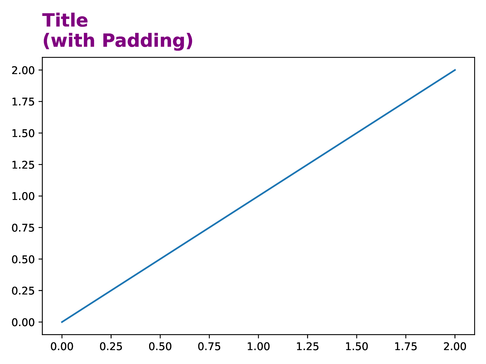

```python
x = np.linspace(0,2,2)
fig, ax = plt.figure(), plt.axes()

ax.plot(x,x)
ax.set_title("Title\n(no Padding)",
            fontsize = 'xx-large',
            weight = 'bold',
            color = 'purple',
            loc = 'left',
            pad = 0)
```

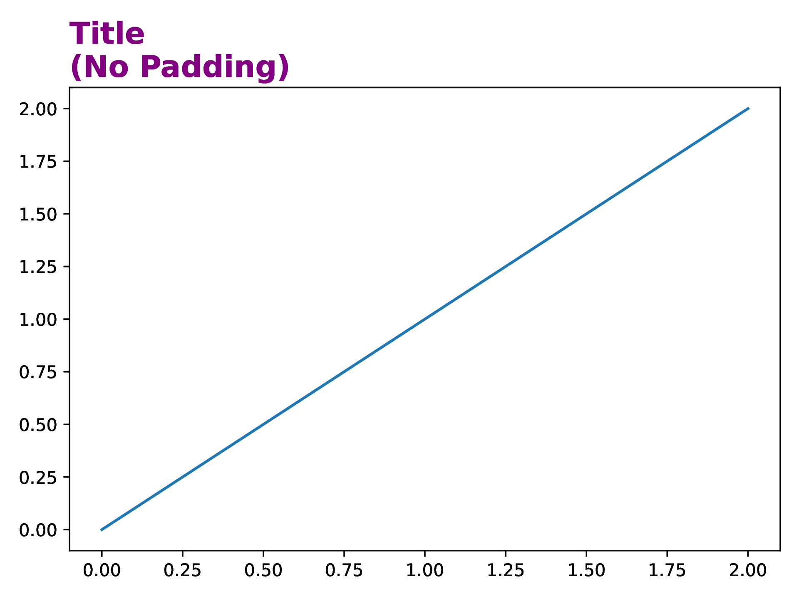

A plot can actually have one title for every `loc` value as well.

```{literalinclude} ../../python/title-loc.py
:language: python
```

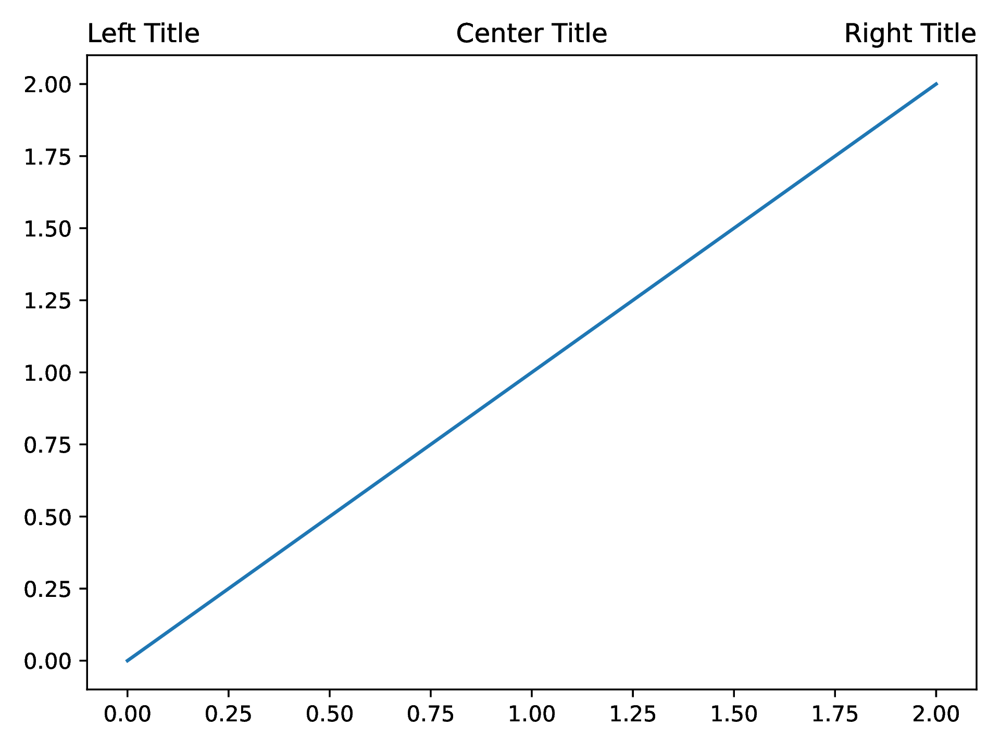

## 4.2 Text and Placement

Matplotlib offers `text` as both a figure and an axes method. Let's start with some code to understand what they do. Both take $x$ and $y$ positions as the first two arguments and then a string. The figure method method is the same as using the axes method with a transformation to figure coordinates.

```{literalinclude} ../../python/text-methods.py
:language: python
```

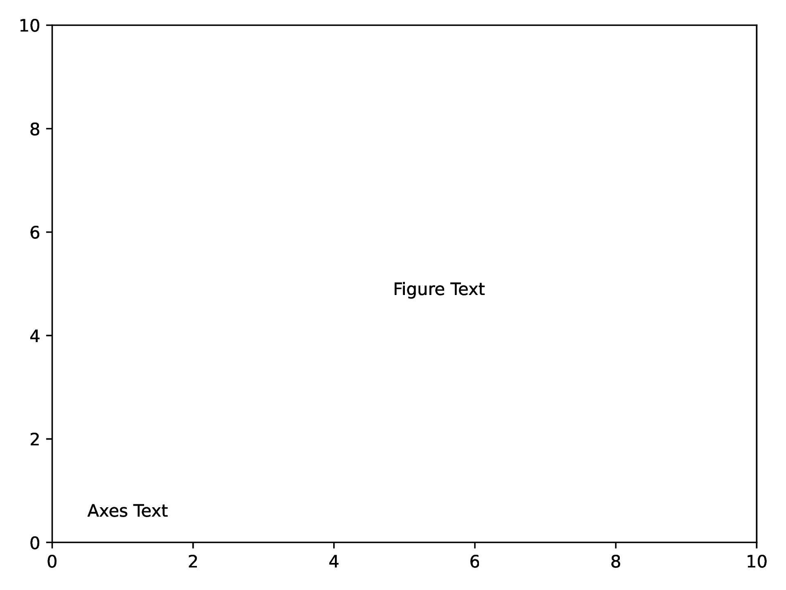

Immediately, we see that despite passing the same $x$ and $y$ position values, the figure and axes methods place the text differently. By default, the figure method uses "figure" coordinates, where (0,0) is the bottom left and (1,1) is the top right. The axes method uses $x$ and $y$ data coordinates by default. We will modify this shortly.

A more common concern is the alignment of the text. Both figure and axes text methods include parameters `verticalalignment` and `horizontalalignment`, which can be abbreviated as `va` and `ha`. By default, the text is placed so that the given coordinate is at the bottom-left corner of the text.

```{literalinclude} ../../python/text-default-align.py
:language: python
```


For vertical alignment, the options are `'top'`, `'bottom'`, or `'center'`. For horizontal alignment, the options are `'left'`, `'right'`, or `'center'`. The default demonstrated above was `'bottom'` and `'left'`. It does result in the text being above and to the right of the coordinate point, perhaps confusingly, but the interpretation is that the coordinate point is at the bottom-left of the text. The possible alignments are illustrated below.

```{literalinclude} ../../python/text-align.py
:language: python
```

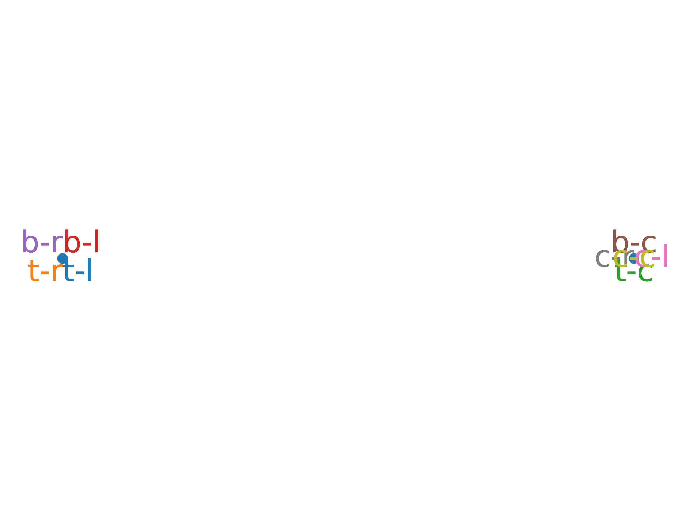

Text can be rotated with the `rotation` parameter. By default, a plot isn't square—the aspect ratio (the ratio of $y$-unit to $x$-unit) is not one. That means that the 45 degree line created by $y=x$ is not actually plotted at 45 degrees. Yet according to the `rotation` parameter, text rotated at 45 degrees is plotted at 45 degrees—that angle is not converted based on the aspect ratio. Later in Section 4.6, I go into further detail in how to use some trigonometry to get the exact angle if you'd like to slope text at some angle, accounting for the aspect ratio.

```{literalinclude} ../../python/text-rotation2.py
:language: python
```

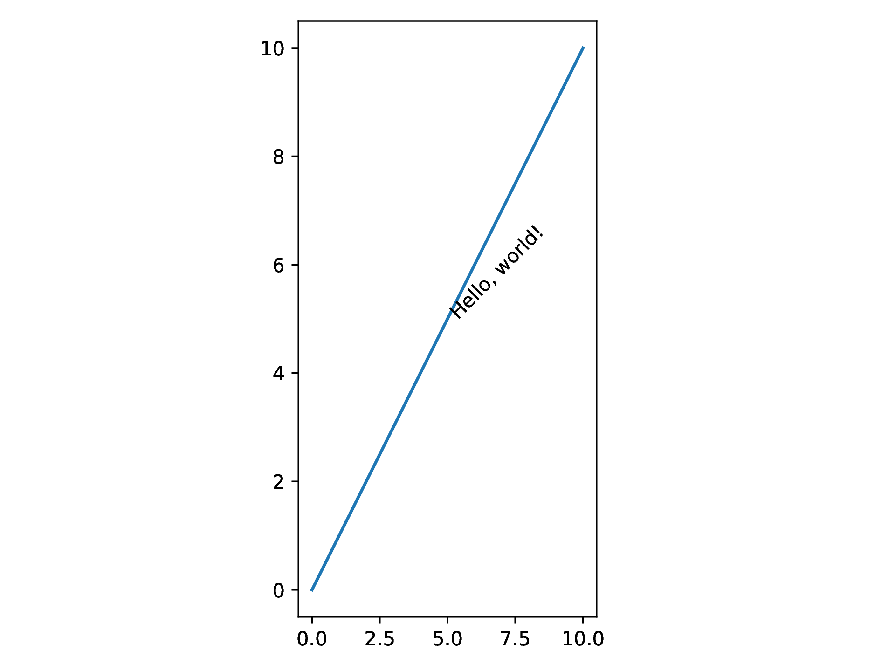
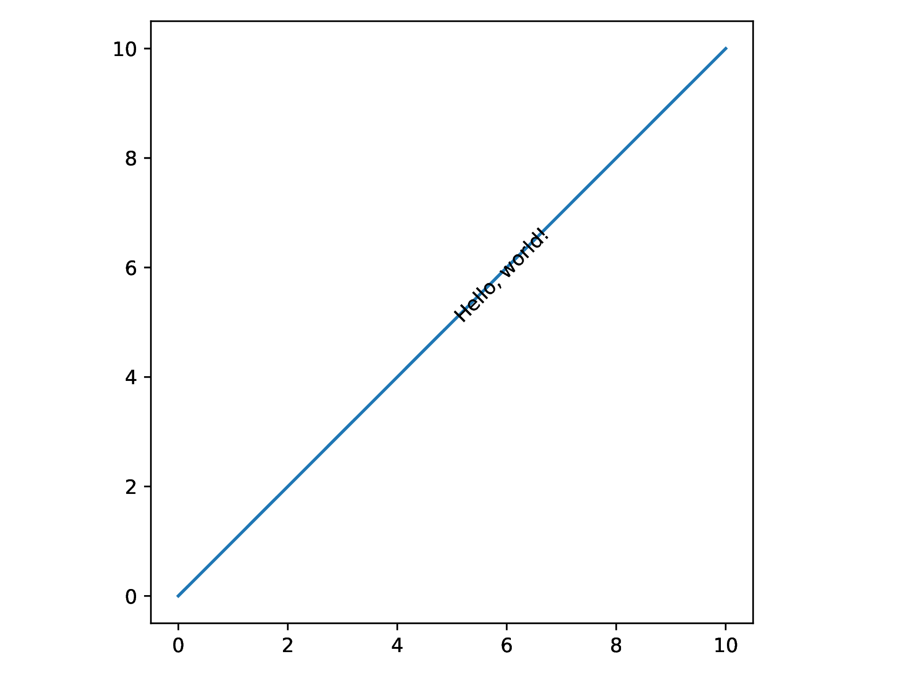
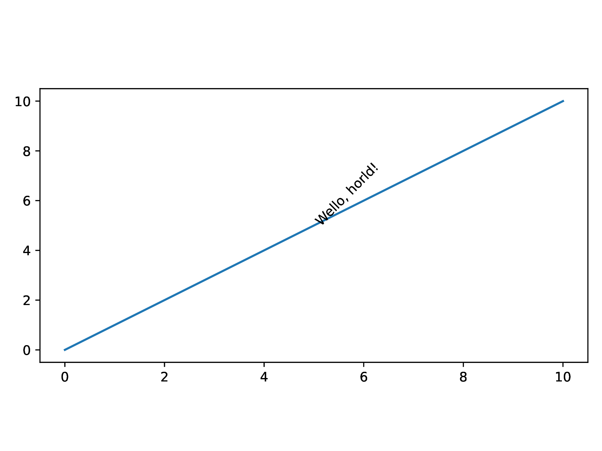

### 4.2.1 Text Formatting for Numbers

Here I've tucked away a subsection on formatting numbers in Python. This has nothing to do with matplotlib, formally speaking. Still, sometimes you want your text annotations or titles to contain numbers formatted just so and you'll want Python to figure that out instead of doing it by hand. You might want commas as the thousands separator (the more readable 1,000,000 instead of 1000000), you might want leading zeros (01 instead of 1), or you might want a currency symbol ($2 instead of 2). The table below demonstrates by example how to do this with `str.format`.

| Code | Output |
|------|---------|
| `'{:,}'.format(10**6)` | `'1,000,000'` |
| `'${:,.2f}'.format(10**6)` | `'$1,000,000.00'` |
| `'{:0>3.0f}'.format(1)` | `'001'` |
| `'{:>3.0f}'.format(1)` | `'  1'` |
| `'${:0>4.0f}'.format(1)` | `'$0001'` |
| `'{:+,.1f}'.format(1000)` | `'+1,000.0'` |
| `'{:0<+4,.1f}'.format(-1)` | `'-1.0'` |
| `'{:0<5.0f}'.format(1)` | `'10000'` |
| `'{:0<5,.0f}'.format(1)` | `'10000'` |
| `'{:0<8,.0f}'.format(1000)` | `'1,000000'` |
| `'{:.0e}'.format(10.1**6)` | `'1e+06'` |
| `'{:.1f} and {:.1f}'.format(9, 1)` | `'9.0 and 1.0'` |
| `'{1:.1f} and {0:.1f}'.format(9, 1)` | `'1.0 and 9.0'` |
| `'{0:} and {0}'.format(1)` | `'1 and 1'` |
| `'{:} and {:}'.format(1)` | `IndexError` |

Understanding everything above requires some knowledge of [format specifications](https://docs.python.org/3/library/string.html#format-specification-mini-language). A format specifier is a string that can specify fill, align, sign, width, grouping option, precision, and type (`[[fill]align][sign][#][0][width][grouping_option][.precision][type]`). These must be properly ordered but anything can be omitted to accept the default. These arguments go inside curly braces and to the right of a colon, `{:}`. The curly braces tell Python where to place the argument you pass to the `format()` method. You can also pass multiple arguments inside `format()`. By default, they are placed in order (the first argument replaces the first `{}` and so on), but to the left of the colon, you can also specify the index value for the argument to use.

The *fill* is a character that can be used to pad the number. Used with a *align* and *width*, we can add leading zeros. The default is a space if no fill character is provided. Using `'0>4'`, this will create leading zeros (right-aligned) up to a width of 4. So `1` becomes `'0001'` and `10000` is not padded, being simply `'10000'`.

The *grouping option* would come next, allowing for a thousands separator of a comma or an underscore. `'{:,}'.format(10000)` produces `'10,000'`. Note that when used with padded numerals on the right, the padding is ignored in finding the thousands separators, so `'{:0<8,.0f}'.format(1000)` produces the confusing `'1,000000'`.

*Precision* is next with a decimal and then how many digits to display past the decimal place or before and after, depending on the lastly specified *type*. Observe `'{:.2}'.format(np.pi)` produces `'3.1'` and `'{:.2f}'.format(np.pi)` produces `'3.14'`. You'll want type `'f'` for a float. Use `'e'` for scientific notation. You may read up on the many other types, including locale aware types, in the Python documentation.

Whatever we put outside the curly braces is simply concatenated to the text on the left or right. So `'${}'.format(123)` turns 123 into the dollar figure `'$123'`. And `'{} lbs.'.format(123)` would produce `'123 lbs'`.

Perhaps this will come in handy when you'd like figure text or the filename in a certain format. I often use leading zeros in some filenames so that alphabetically ordering the files will be coherent (your file system will likely maintain `'1' < '10' < '2'`). If you are creating many plots that will be frames in an animation, and you'll have some number ticking up as the frames progress, the padding might help the eye.

```{literalinclude} ../../python/text-formatting.py
:language: python
```

  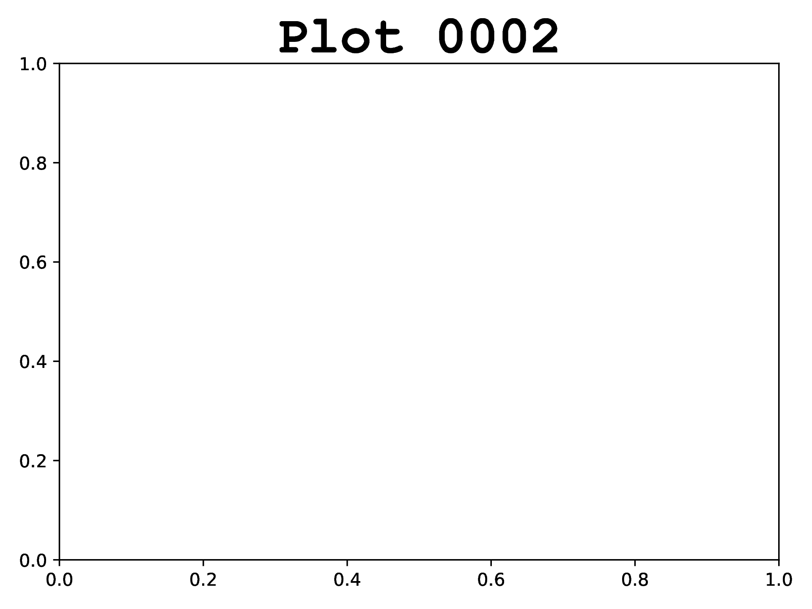

## 4.3 Legends

As you should know, legends provide a key to the colors and symbols used in a plot. You can create a legend with `legend()`, as either a figure or axes method. Without any extra customization this is done with `ax.legend()` or `fig.legend()`. Here, we will only cover axes legends. We'll return to figure legends when they are more naturally useful in Chapter 7 on multiple axes and multiple plots.

But first, you need labels for your plot elements (called *artist* objects) before you can create a legend. This can be done with the `label` parameter in methods like `plot()`. Or you can use `set_label()` on the plot element object. Using `set_label()` adds some complication to the code, as seen below in an otherwise simple example. Note the legend needs to be added after the labeled plot elements you want included in the legend.

```{literalinclude} ../../python/legend-labels.py
:language: python
```

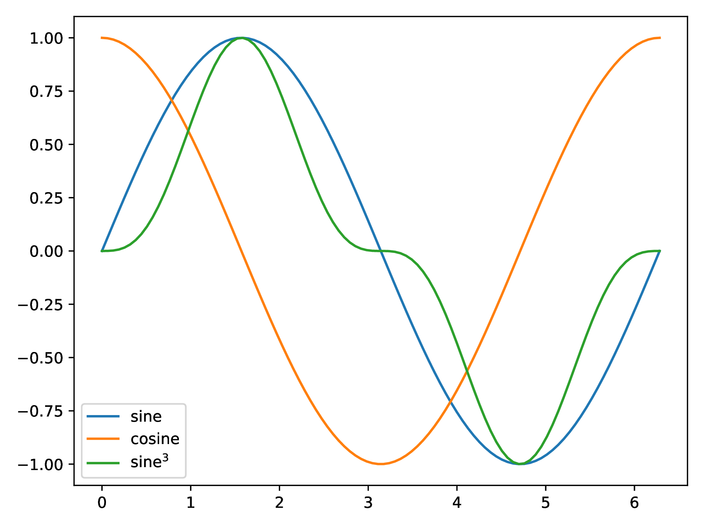

If you are using a pandas plot method, the labels will be set automatically according to the column or series names. For such instances where an element is automatically included in a legend and you want to exclude it, you can exclude that element by specifying `label = '_nolegend_'` in the plot call.

```{literalinclude} ../../python/pd-legend.py
:language: python
```

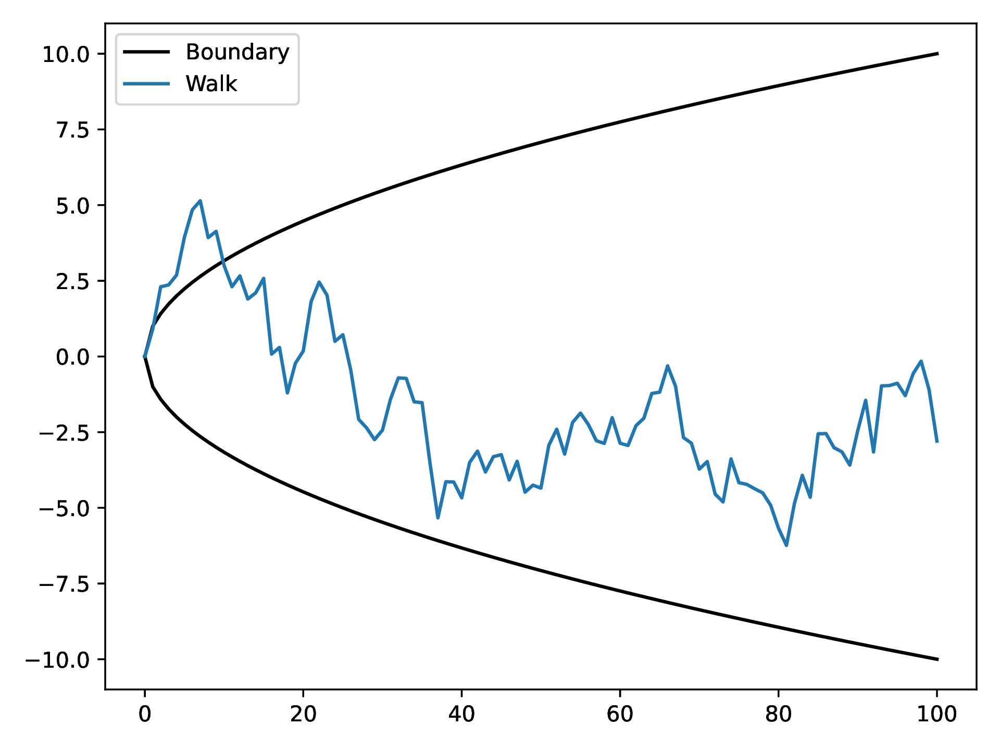

A more common concern might be how to customize the placement of the legend and its actual appearance.

To change the placement of the legend, you may use the `loc` parameter. The default value is `'best'`, where best is determined by matplotlib. Other valid values are `'center'` and `'right'` (but not `'left'`) and then modifications like `'upper center'`, `'center right'`, and `'lower left'`.

For further customization of the placement, use the `bbox_to_anchor` parameter. This accepts 2-tuple or 4-tuple, giving the $x$ location, the $y$ location, and the width and height optionally.

By default, $x$ and $y$ are in axes coordinates. So the program below places a legend in the top and center of the axes. The alignment is done according to `loc`. If, for example, `loc = 'lower right'`, then the lower right corner of the legend is placed at the specified $x$ and $y$.

```{literalinclude} ../../python/legend-bb.py
:language: python
```

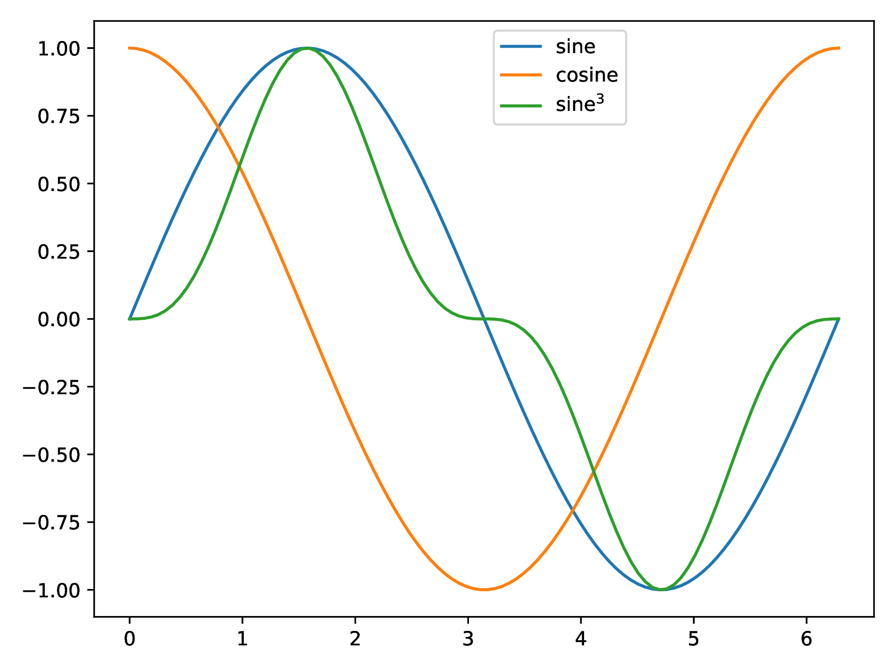

```{literalinclude} ../../python/legend-bb-loc.py
:language: python
```

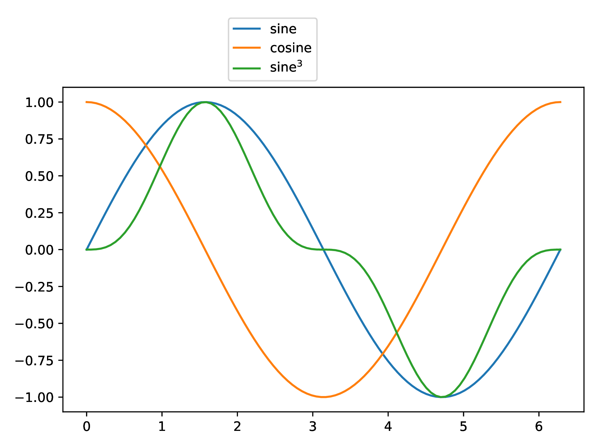

If using a 4-tuple, the tuple is interpreted as the plot region in which to put the legend, according to `loc`.

Use `bbox_transform` to use a coordinate system other than the default axes coordinates.

```{literalinclude} ../../python/legend-transform.py
:language: python
```

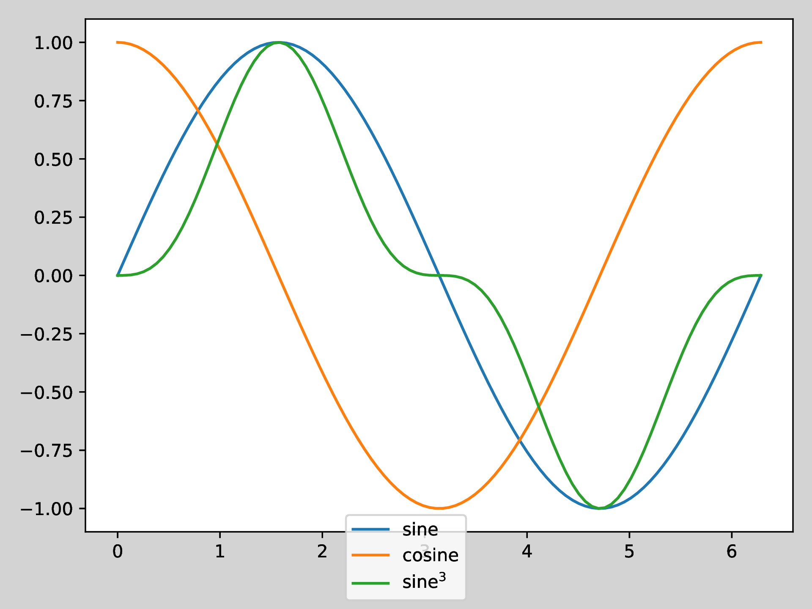

There are many parameters to change the appearance of the legend. We won't cover all of them. Two useful parameters are `facecolor` and `ncol`. The former changes the background color of the legend and the latter sets the number of columns, changing the default shape of the legend. I use these and a few other self-explanatory parameters in the program below.

```{literalinclude} ../../python/legend-shape.py
:language: python
```

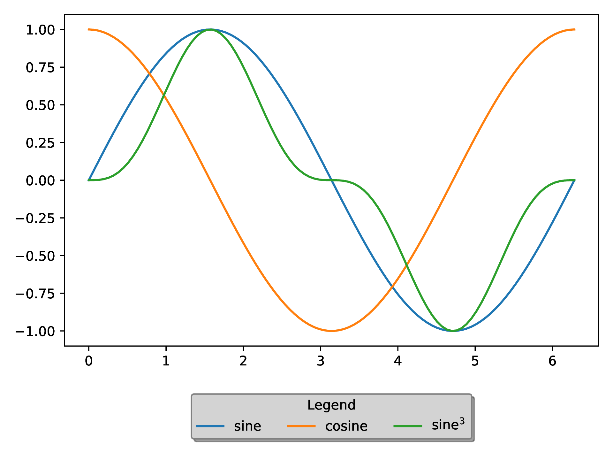

## 4.4 Annotations

Knaflic (2015) and Schwabish (2021) both advise to label data directly and to annotate graphs with explanatory notes when helpful, as this helps convey the meaning of the graph more simply and directly.

You can annotate a chart with `text()` method calls, or you can use the `annotate()` method, for which you specify the text placement and a line segment to the part of the graph the text references.

### 4.4.1 Labeling and Arrows

The following graph is nothing special, but we avoid having to create a legend by labeling the data with the text color matching the line color.

```{literalinclude} ../../python/label-data.py
:language: python
```

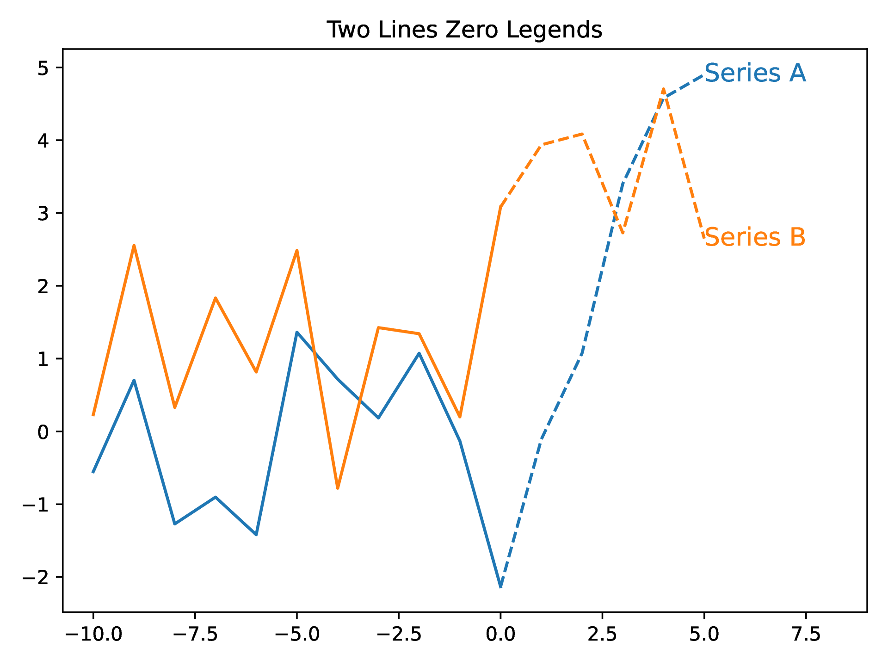

Next, we use the `annotate()` method. This method comes with the option to include an arrow pointing from `xytext` to the point `xy`.

```{literalinclude} ../../python/annotate-arrow.py
:language: python
```

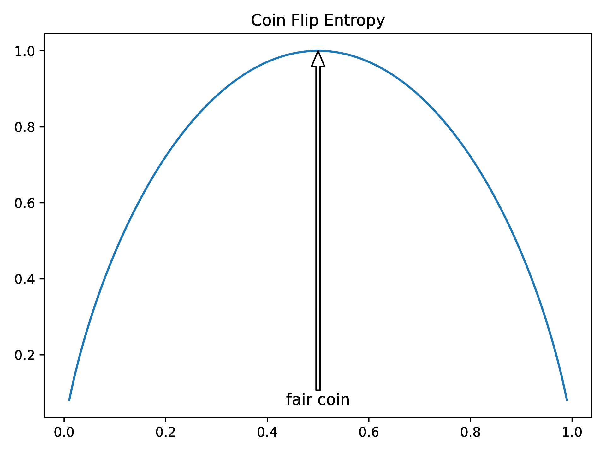

If you would like an arrow and no text, simply use the empty string `''`. It is necessary to pass a dictionary to the `arrowprops` property.

```{literalinclude} ../../python/arrow-only.py
:language: python
```

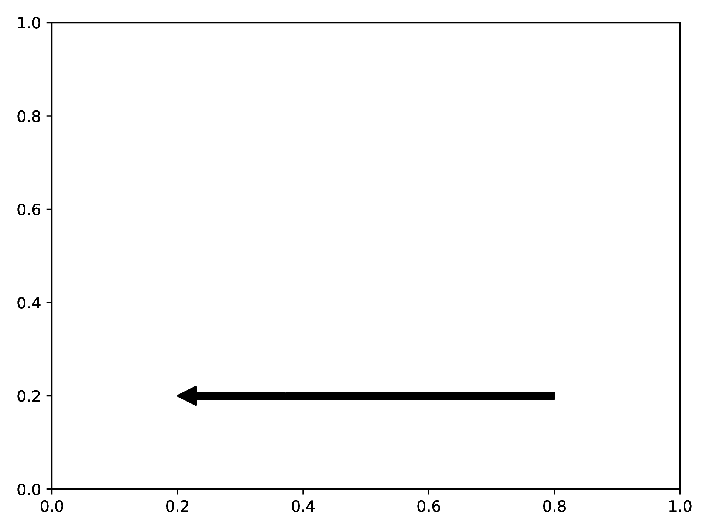

Lastly, one can also reference specific artist objects in the annotation instead of coordinates. In the below we place the annotations at the end of `a_line` and `b_line`.

```{literalinclude} ../../python/direct-annotation.py
:language: python
```

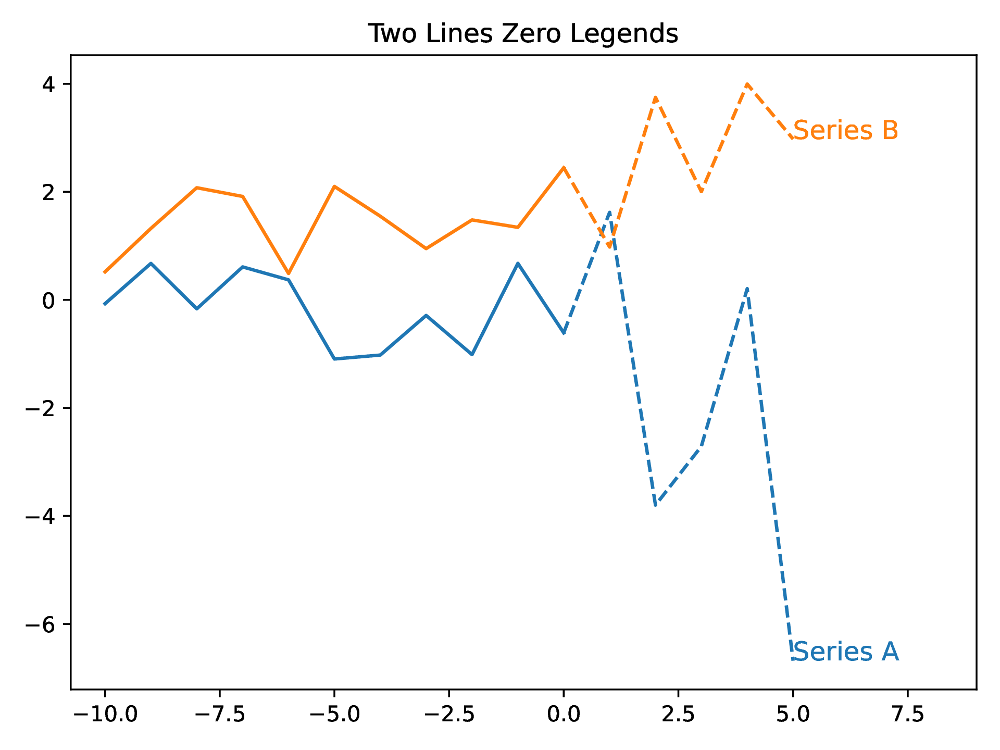

## 4.5 Fancy Titles

If you'd like to format different parts of the title different, you'll have to move beyond simply using `set_title`. The New York Times, for example, routinely includes a title and a subtitle in a plot. This requires using `text()` and `set_title()` separately, as there can only be one format style applied to a title. A simple example is below.

```{literalinclude} ../../python/subtitle.py
:language: python
```

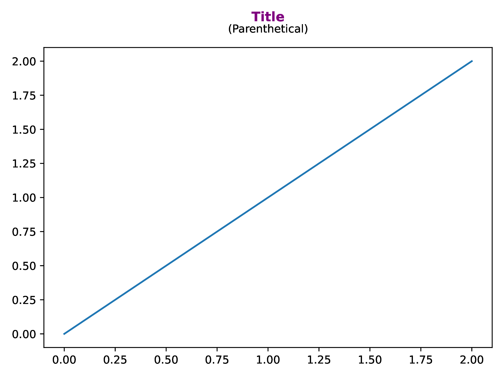

### 4.5.1 Multi-colored Titles

In Chapter 3, we created a multi-colored title using the Artist method `get_window_extent()`. The advantage of a multi-colored title is that we can do without a legend. For someone who doesn't want to get into the complications of `get_window_extent()`, the $x$ and $y$ placement of the text could be done by sight.

```{literalinclude} ../../python/multicolor-inexact.py
:language: python
```

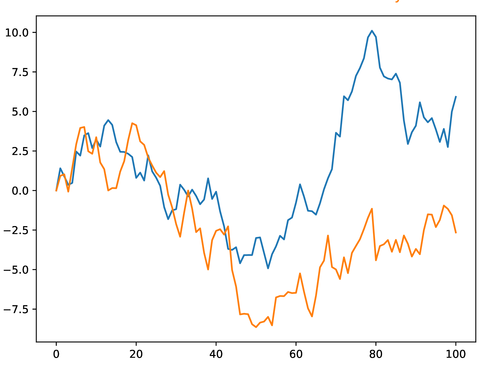

Greater elegance requires greater complication. If you are (understandably) dissatisfied with the above, invest in the topics covered in Chapter 3.
Below, we build on the solution from Chapter 3 by creating a function that creates a multi-colored title. Note we remove text options with the `remove()` method and work all in a single figure. This replaces the work of tuning the centering by hand that was done previously.

```{literalinclude} ../../python/color-title.py
:language: python
```

```{literalinclude} ../../python/color-title-ex.py
:language: python
```

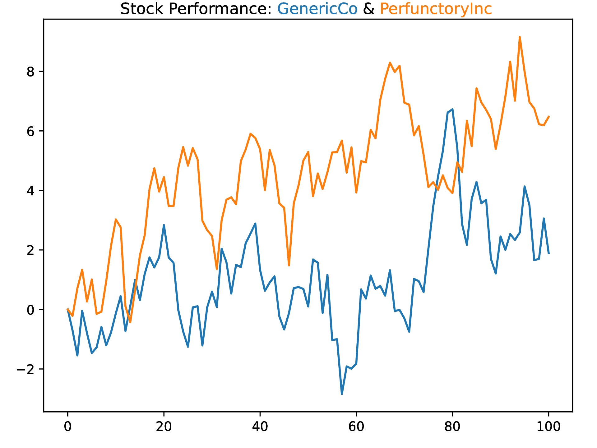

## 4.6 Fonts

Finally, you might want to customize the fonts. In matplotlib 3.6 and newer, there is a `get_font_names()` method that can be used to display available font names. The code below creates a figure for each font. I get several warnings with messages like "Glyph 105 (i) missing from current font."

```{literalinclude} ../../python/font.py
:language: python
```

### 4.6.1 Importing Fonts with Font Manager

If you're unsatisfied with the basic fonts available in matplotlib, just add your own. You can find fonts available for download from [theleagueofmoveabletype.com](https://www.theleagueofmoveabletype.com/) or [fonts.google.com](https://fonts.google.com).

After you've downloaded a font family, you should have folder for that font with otf or ttf files. Matplotlib has a font manager and you just need to tell matplotlib to look for a font in that folder. This is done below using `findSystemFonts()` and `addfont()`. Once the font files are added, you can simply specify the font in the `text()` call like any other in-built font.

```{literalinclude} ../../python/font.py
:language: python
```

