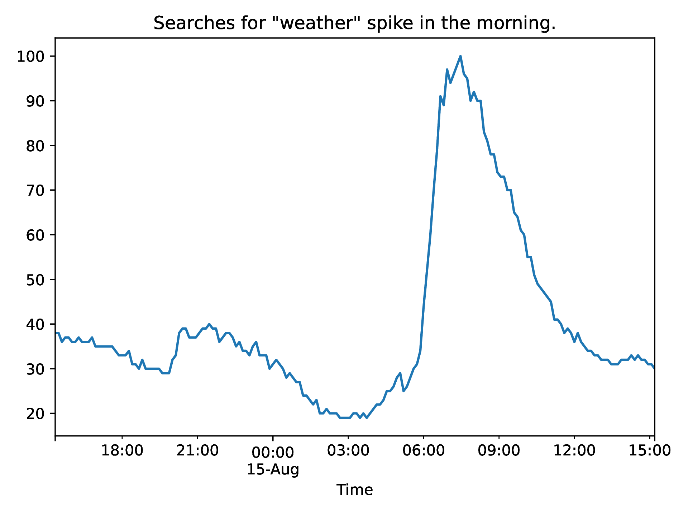
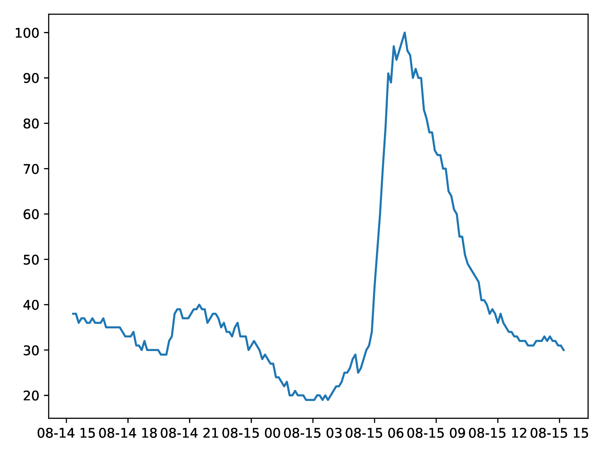
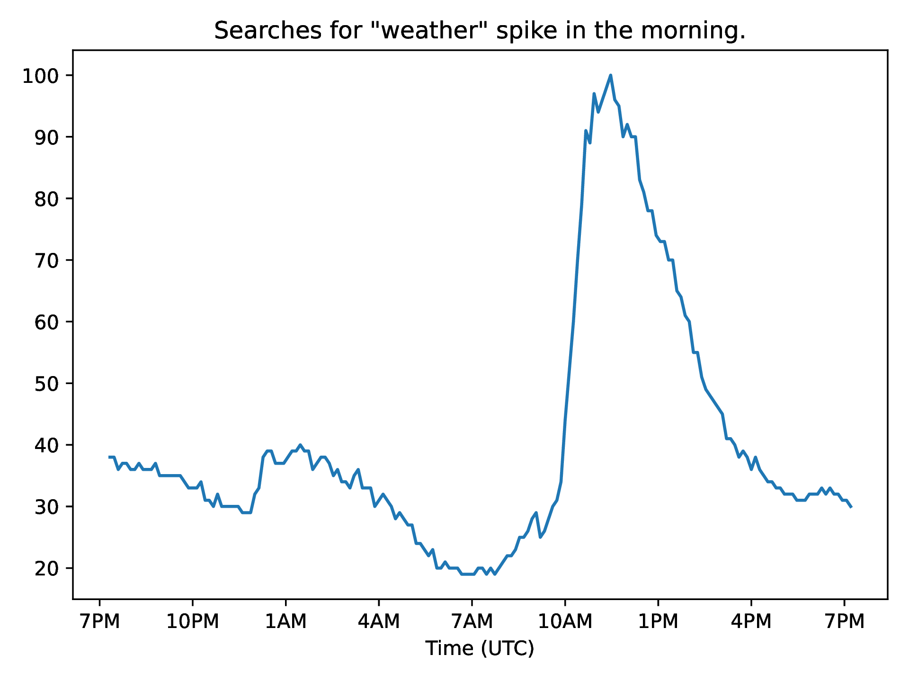

# Chapter 5: Dates

Matplotlib can handle dates, helping you to create better axis ticks and label formatting. Matplotlib's capabilities are built on the datetime and dateutil modules.

## 5.1 Plotting

Let's import some time series data. Below we use pandas integration and plot from a DataFrame with an index of pandas Timestamp values. Matplotlib recognizes these as dates and handles this reasonably well automatically, though the exact formatting could be improved.

```{literalinclude} ../../python/pd-dates.py
:language: python
```



Before we try to improve the formatting, see what happens if we try to use the axes plot method.

```{literalinclude} ../../python/ax-dates.py
:language: python
```



You might find code using `plot_date()`, which used to be used in place of `plot()`. This is no longer necessary.

### 5.1.1 Time Zone Handling

For a deeper knowledge, see the `datetime.tzinfo` class and the `pytz` library. TK

## 5.2 Ticks and Formatting

### 5.2.1 Date Formats

The specific format of the displayed dates and times can be modified with `mdates.DateFormatter()`. This takes a format string and creates a formatter that can be passed to an axis method `set_major_formatter()` or `set_minor_formatter()`.

Here are some common format codes, applied to Sunday January 30, 2000, 11:59PM, local to Louisville, Kentucky. These can all be verified with `pd.Timestamp(year = 2000, month = 1, day = 30, hour = 23, minute = 59, tz = 'America/Kentucky/Louisville').strftime()`.

| Code | Output/Example |
|------|----------------|
| `'%Y'` | 4-Digit Year |
| `'%m'` | Month Number |
| `'%d'` | Day of Month |
| `'%B'` | Month Name |
| `'%H'` | 24-Hour Clock Hour |
| `'%M'` | Minute |
| `'%I'` | 12-Hour Clock Hour |
| `'%p'` | AM or PM |
| `'%A'` | Day of Week |
| `'%Z'` | Timezone Name |
| `'%Y-%m'` | `'2000-01'` |
| `'%Y/%m/%d'` | `'2000/01/30'` |
| `'%B %y'` | `'January 00'` |
| `'%H:%M %Z'` | `'23:59 EST'` |
| `'%A %I%p'` | `'Sunday 11PM'` |

A more complete list of format codes can be found at [strftime.org](https://strftime.org). Codes that generate actual names, like `'%A'` or `'%B'`, can be made lowercase to produce an abbreviated name. Notice that these formats create zero-padded numbers like `'07'` instead of `'7'`. On Mac or Linux, padding can be eliminated with the `'-'` modifier, using `'%-H'` or `'%-m'` instead of `'%H'` or `'%m'` for example. On Windows, use `'#'`.

```{literalinclude} ../../python/date-fmt.py
:language: python
```


```{literalinclude} ../../python/date-fmt2.py
:language: python
```

