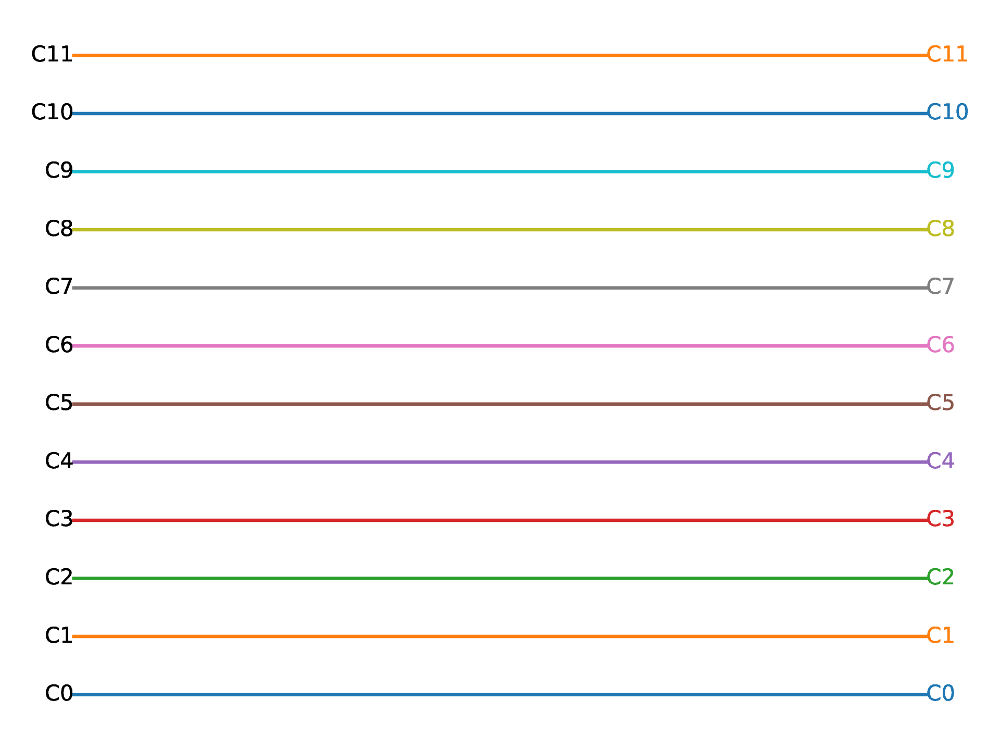
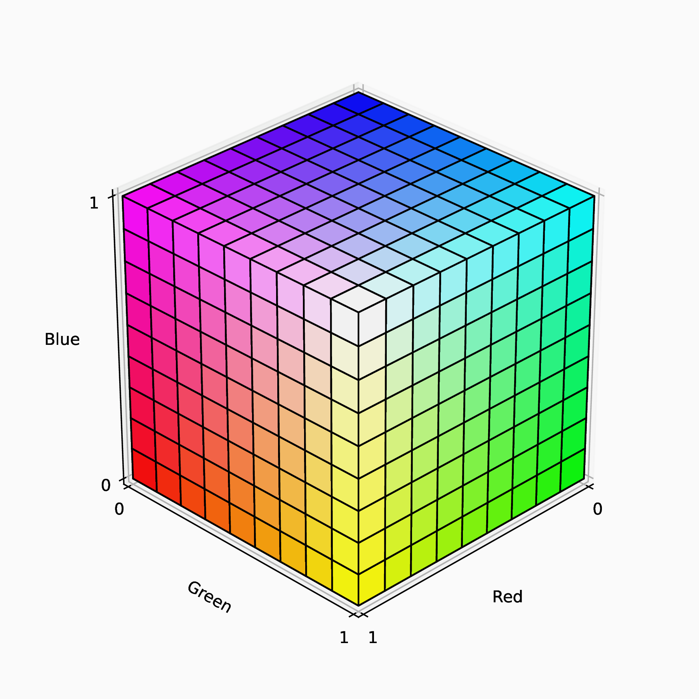
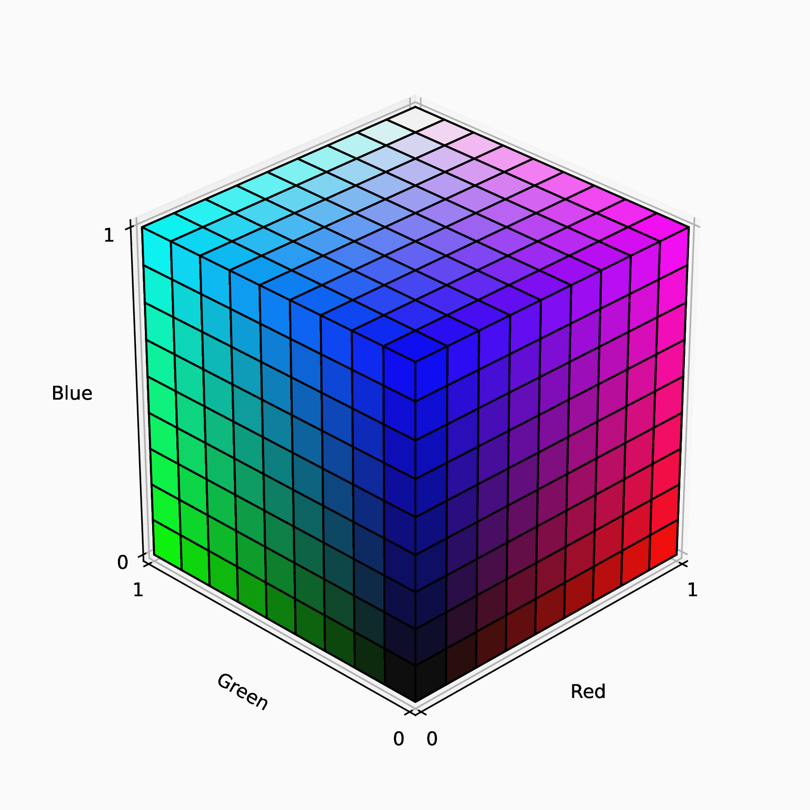
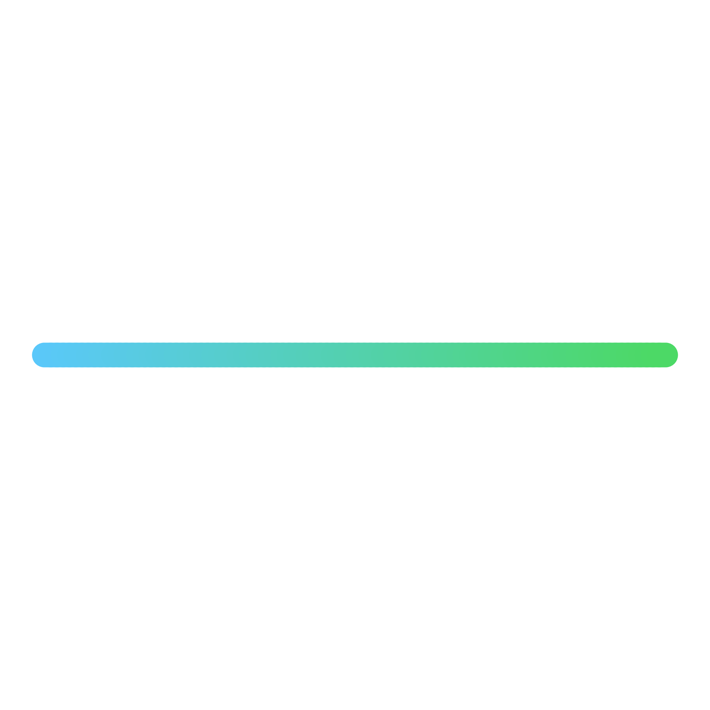
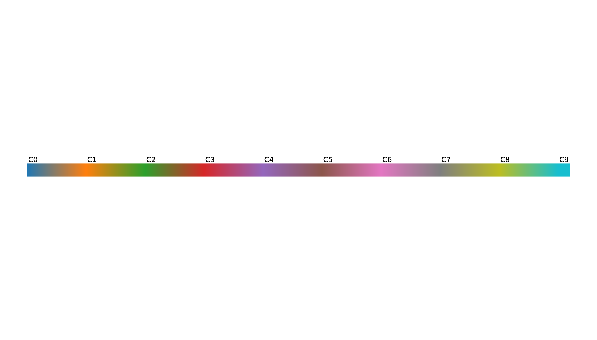

# Chapter 6: Colors

Methods like `plot` and `text` include a color parameter, which we've already made use of. While you can get pretty far simply using `color = 'blue'`, you might also make use of colormaps or set your own colors using hex strings or RGB(A) tuples.

## 6.1 Colormaps

According to the style sheet you are using, there will be some colormap and you will cycle through those colors by default when plotting (but not for text). The colors can be identified by the strings `'C0'`, `'C1'`, ... If, as in the default, your color map has only 10 distinct colors, then the eleventh color `'C10'` is valid, but simply refers to `'C0'` and the colors cycle from there. You'll notice that with successive plot calls on the same axes, the colors will automatically move through the colormap. This is not the case with text, as is demonstrated in the program below.

```{literalinclude} ../../python/colors.py
:language: python
```



## 6.2 Red, Green, Blue, Alpha

An RGB color is given by three values, specifying the amount of red, green, and blue. In matplotlib, these values are between zero and one (you might also see RGB values between zero and 255 elsewhere). These colors live inside a cube, as a particular color is a triple $(r,g,b) \in [0,1]^3$.

 

I like working with RGB tuples because they can be manipulated with mathematical operations. Two colors can easily be averaged or we can create a gradient between two.

```{literalinclude} ../../python/gradient.py
:language: python
```



Any color can be made lighter by averaging it with white, $(1,1,1)$, or darker by averaging it with black $(0,0,0)$. We can also find the inverse of an RGB color by simply subtracting that triple from $(1,1,1)$. RGBA tuples are very similar, adding a fourth *a*lpha value for the opacity.

With RGB and RGBA colors being so handy, you might want to convert strings like `'C0'` into RGB. `ColorConverter()` lets us do this, with the `to_rgb()` and `to_rgba()` methods. Below, we create another color gradient between the default `'C0'` blue, to `'C1'` orange, and on to light blue `'C9'`.

```{literalinclude} ../../python/color-map.py
:language: python
```



### Color Cube Code

Here is the code for one of the RGB color cubes.

```{literalinclude} ../../python/color-cube.py
:language: python
```