# Chapter 7: Multiple Axes and Plots

## 7.1 Multiple Axes

Let's start with a concrete goal to help illustrate possible uses of multiple axes. We want to plot a standard normal distribution. This is the familiar bell curve with a range of possible draws from the normal distribution on the $x$-axis and $y$ values are the value of the probability density function (PDF) evaluated at each $x$ value. Furthermore, we have a $z$-score and we want the visual to help us see how often we should get smaller $z$-scores if we are sampling from this distribution. In particular, let's say our $z$-score is 0.674.

To answer the question narrowly, the following plot does the job well and without reaching for multiple $x$- or $y$-axes.

```python
from scipy import stats

fig, ax = plt.figure(figsize = (8,6)), plt.axes()

# Set z-score
z = 0.674

# Create x values
x = np.linspace(-4, 4, 1000)
y = stats.norm.pdf(x)

# plot the PDF
ax.plot(x, y, linewidth = 2)

# Highlight the z-score
ax.plot(z, stats.norm.pdf(z), 'o', markersize = 10, color = 'black')

# Shade the area below the z-score
ax.fill_between(x[x <= z], 0, y[x <= z], alpha = 0.2)

# Title and labels
ax.set_title(f'z-score = {z} is at the {100*stats.norm.cdf(z):.0f}%ile')
ax.set_xlabel('$z$')
ax.set_ylabel('Probability Density')

# Move bottom spine to 0
ax.spines['bottom'].set_position('zero')
ax.spines['top'].set_visible(False)
ax.spines['right'].set_visible(False)
```

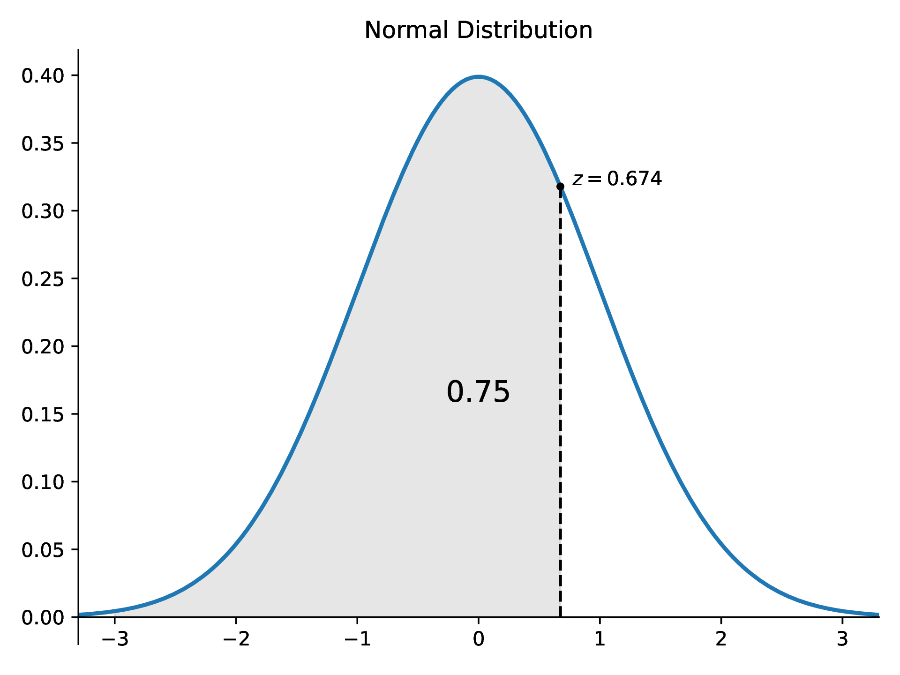

Still, it leaves the reader to rely on their eyeballing abilities to imagine how that area might change if the $z$-score changed. The graph itself lacks information from the cumulative density function (CDF), used to calculate that our $z$-score at the 75%ile of values drawn from the standard normal distribution. If your reader might be interested in this kind of thought exercise, you should include more of this information in the plot. First, we might add this information by simply plotting both the PDF and CDF together. Eyeballing is still necessary to imagine how much rarer a $z$-score of 0.7 is, but at least with the CDF included, we can be a little more precise.

```python
fig, ax = plt.figure(figsize = (8,6)), plt.axes()

# Create x values
x = np.linspace(-4, 4, 1000)
y = stats.norm.pdf(x)
y_cdf = stats.norm.cdf(x)

# plot the PDF
ax.plot(x, y, linewidth = 2, label = 'PDF')
ax.plot(x, y_cdf, linewidth = 2, label = 'CDF')

# Title and labels
ax.set_title(f'Standard Normal Distribution')
ax.set_xlabel('$z$')
ax.set_ylabel('Probability')

ax.legend()
```

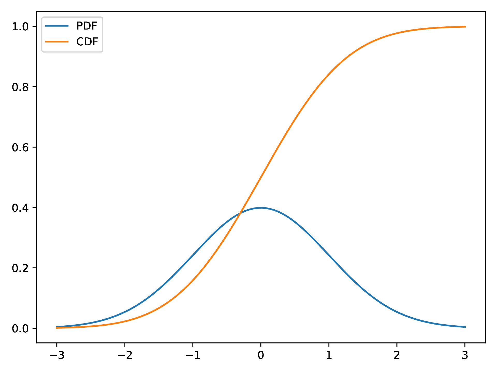

Still, the plot above isn't very good. Here, more ticks or a grid would be helpful for tracing out what the CDF value is for a particular $z$-score. But apart from that, you might also see that the orange CDF dwarfs the blue PDF. While not terribly extreme, these functions cover different enough $y$ values that having a shared $y$-axis is questionable, because the point isn't to draw attention to this difference. One fix for this is to create a second $y$-axis on the right. Knaflic (2015) advises against a secondary $y$-axis. Dual axis charts aren't as immediately readable, so do be judicious and take extra care to make it clear which plot corresponds to which $y$-axis.

### 7.1.1 Using `twinx()` and `twiny()`

If we want a second $y$-axis, or a dual $y$-axis chart, we can start by creating a plot as usual, creating figure and axes objects `fig, ax`, and then create one more axes object with `ax.twinx()`. Give that a name, `ax2` is what I use below, and the basics are all the same from there. A dual $y$-axis chart is created with `twinx()` because it is the $x$-axis that is shared and the $y$-axes are independent.

Let's take a brief detour from our normal distribution plots to illustrate some of the basics. You'll notice a few problems with the following plot.

```python
fig, ax = plt.figure(figsize = (8,6)), plt.axes()
ax2 = ax.twinx()

# Plot 
x = np.arange(10)
ax.plot(x, x)
ax2.plot(x, x**2)

# Labels and titles
ax.set_xlabel("X Values")
ax2.set_xlabel("x values") # does nothing
ax.set_ylabel("Linear")
ax2.set_ylabel("Quadratic")
ax.set_title("Linear")
ax2.set_title("Quadratic")

# Legends
ax.legend(['linear'], loc = 'upper left')
ax2.legend(['quadratic'], loc = 'upper right')
fig.legend() # Does nothing without passing labels or handles
```

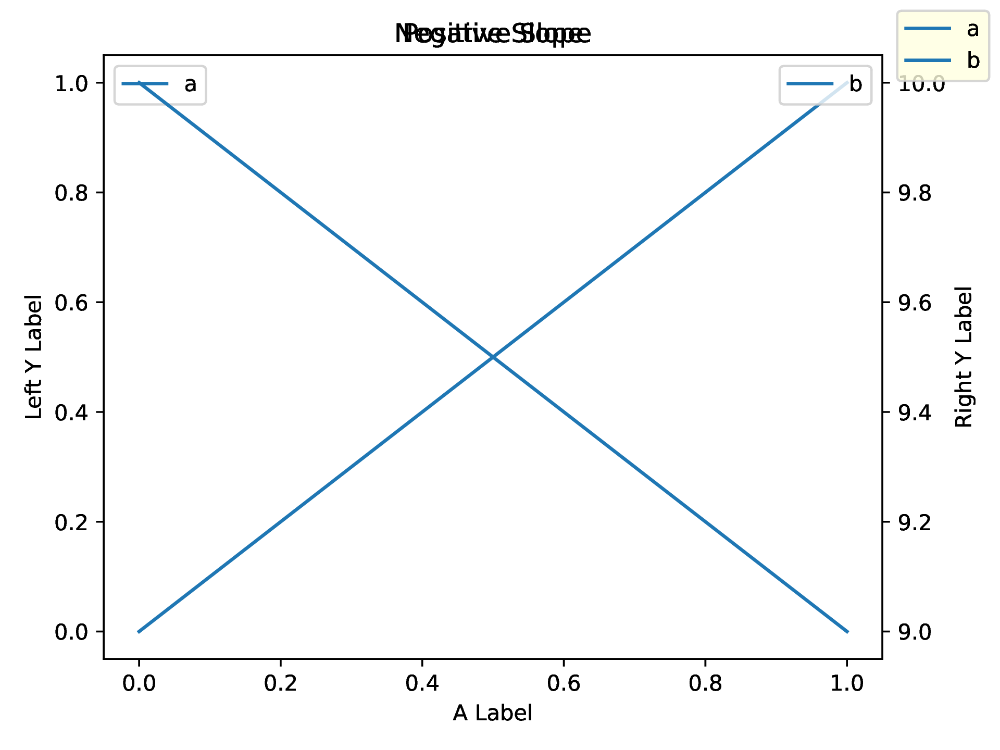

From the second `plot()` call, everything starts to go downhill.

1. The plotted lines are the same color.
2. `set_xlabel()` does nothing for the $x$-axis-sharing twin axes.
3. The titles overlap.
4. `legend()` fails as an *axes* method. The figure legend isn't placed well.
5. It's not clear what line plot corresponds to what axis.

To fix the color issue, we must explicitly pass color values. The fixes for the second and third items are simple. Just use the original axes object for titling and labeling the shared axis. For the fourth, legend issue, we must use `legend()` as a figure method and explicitly pass a `loc` value. To clarify what line plot corresponds to what $y$-axis, we can tell the reader with our $y$-axis labels. This isn't a great solution, but it's where we'll start for the most basic fix. To match a line to its axis, we have too many steps to follow: match the plot to its label with the legend and then match the label to its axis.

```python
fig, ax = plt.figure(figsize = (8,6)), plt.axes()
ax2 = ax.twinx()

# Plot 
x = np.arange(10)
line1, = ax.plot(x, x, color = 'blue')
line2, = ax2.plot(x, x**2, color = 'orange', linestyle = ':')

# Labels and titles
ax.set_xlabel("X Values")
ax.set_ylabel("Linear (Blue Line)")
ax2.set_ylabel("Quadratic (Orange Dotted)")
ax.set_title("One title shared by the twin axes")

# Figure legend
fig.legend([line1, line2], ['linear', 'quadratic'],
           loc = 'center')
```

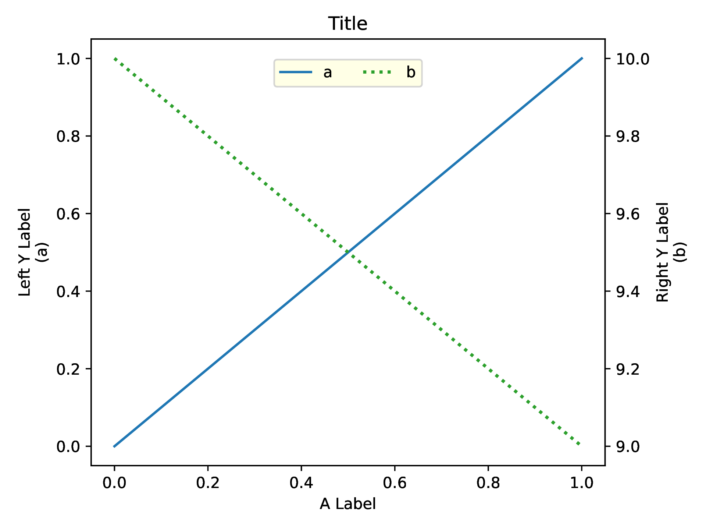

Returning to the normal distribution, we'll try to do a better job of making it more visually apparent what pieces of the plot belong to what $y$-axis.

```python
fig, ax = plt.figure(figsize = (8,6)), plt.axes()
ax2 = ax.twinx()

# Create x values
x = np.linspace(-4, 4, 1000)
y = stats.norm.pdf(x)
y_cdf = stats.norm.cdf(x)

# plot the PDF
ax.plot(x, y, linewidth = 2, color = 'purple')
ax2.plot(x, y_cdf, linewidth = 2, color = 'gray')

# Title and labels
ax.set_title(f'Standard Normal Distribution')
ax.set_xlabel('$z$')
ax.set_ylabel('Probability Density')
ax2.set_ylabel('Cumulative Density')

# Format tick labels
for label in ax.get_yticklabels():
    label.set_color('purple')
    label.set_weight('bold')
for label in ax2.get_yticklabels():
    label.set_color('gray')
```

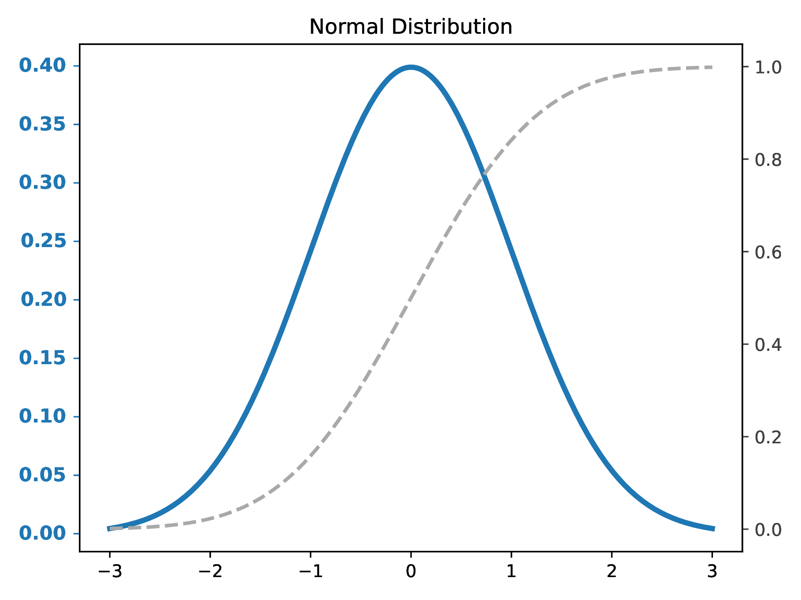

Here, the CDF plot and the secondary axis serve as a kind of footnote to the main point in the CDF.

Adding the cumulative distribution function helps, but that S-curve adds visual noise someone familiar with PDFs and CDFs might be better off without. One solution might be to add a second $x$-axis which annotates the chart with the CDF value at each point on the first $x$-axis.

```python
fig, ax = plt.figure(figsize = (8,6)), plt.axes()
ax2 = ax.twiny()

# Create x values
x = np.linspace(-4, 4, 1000)
y = stats.norm.pdf(x)

# plot the PDF
ax.plot(x, y, linewidth = 2, color = 'black')

# Title and labels
ax.set_title(f'Standard Normal Distribution', 
             pad = 40) # More padding
ax.set_xlabel('$z$')
ax.set_ylabel('Probability Density')

# Set up ax2 to show percentiles
xticks1 = ax.get_xticks()
percentiles = [f'{100*stats.norm.cdf(z):.0f}' for z in xticks1]
ax2.set_xticks(xticks1)
ax2.set_xticklabels(percentiles)
ax2.set_xlabel('Percentile', color = 'red')
ax2.tick_params(axis='x', colors='red')
```

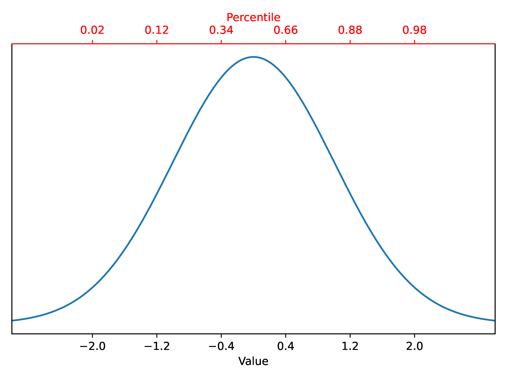

## 7.2 Multiple Plots

We can add several subplots to a figure in several different ways. We'll go over using `plt.subplots` and `fig.add_subplot`. `plt.subplots` is also useful as a shortcut, as `fig, ax = plt.figure(), plt.axes()` can be replaced with `fig, ax = plt.subplots()` for any figure with just one subplot (i.e. in every previous instance of `fig, ax` in this book.) as the default is a $1\times 1$ grid of a single plot.

### 7.2.1 Using `subplots`

`plt.subplots` creates a figure *and* and axes object(s). The first two arguments are `nrows` and `ncols` for the number of rows and columns in the resulting plot grid. If the grid is not $1\times1$, then you will have multiple axes objects in an array. Let's have a look.

```python
fig, ax = plt.subplots()
ax.set_title("1x1 Grid")
```

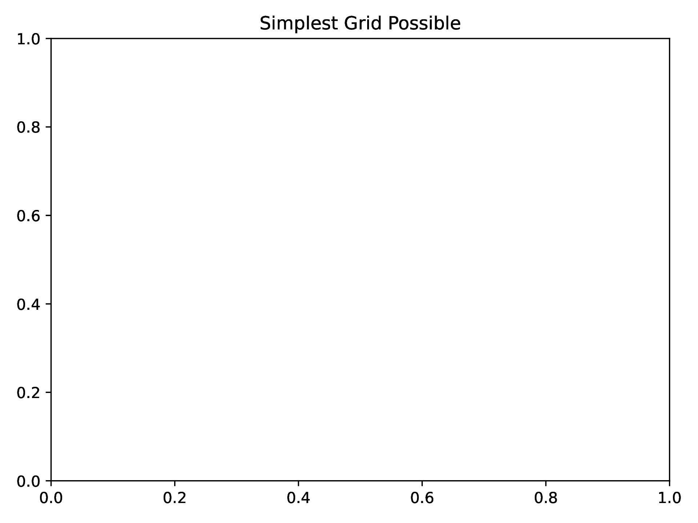

Now, let's make non-trivial grids. Here, `ax` is a 1D array.

```python
fig, ax = plt.subplots(1,2)
ax[0].set_title("1D Array Index 0")
ax[1].set_title("1D Array Index 1")
plt.tight_layout()
```

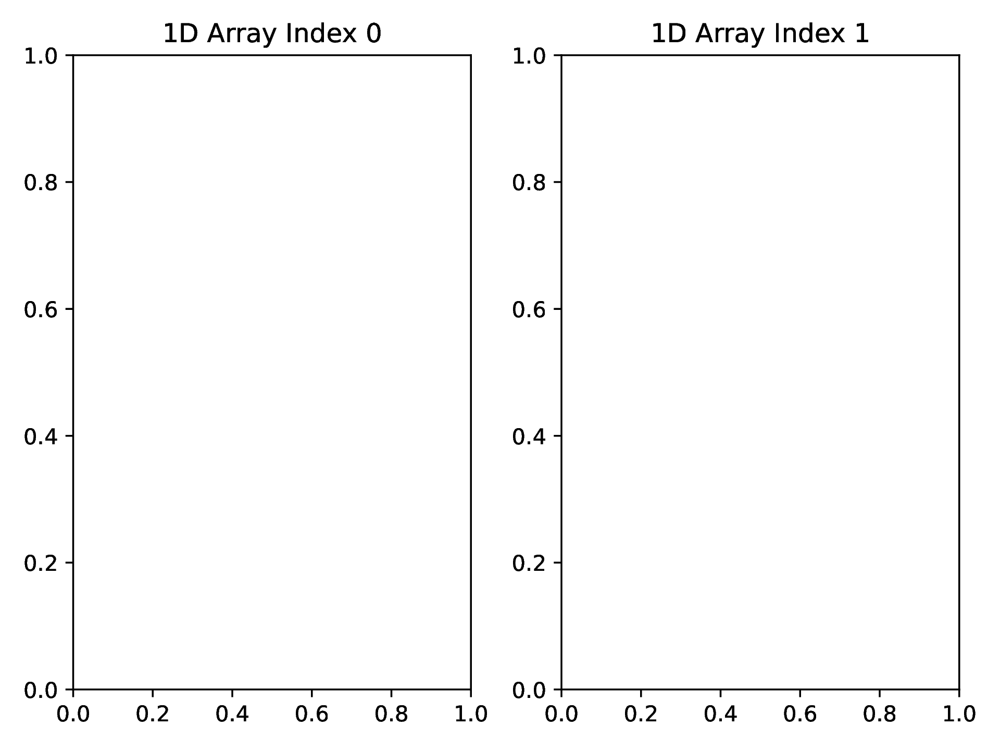

Below, `ax` is again a 1D array.

```python
fig, ax = plt.subplots(2,1)
ax[0].set_title("1D Array Index 0")
ax[1].set_title("1D Array Index 1")
plt.tight_layout()
```

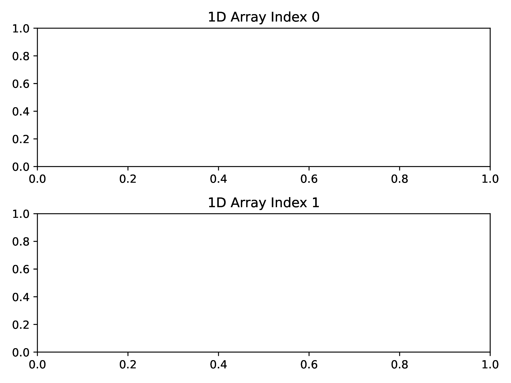

Next, with multiple rows and columns, `ax` is a 2D array.

```python
fig, ax = plt.subplots(2,2)
ax[0][0].set_title("0, 0")
ax[0][1].set_title("0, 1")
ax[1][0].set_title("1, 0")
ax[1][1].set_title("1, 1")
plt.tight_layout()
```

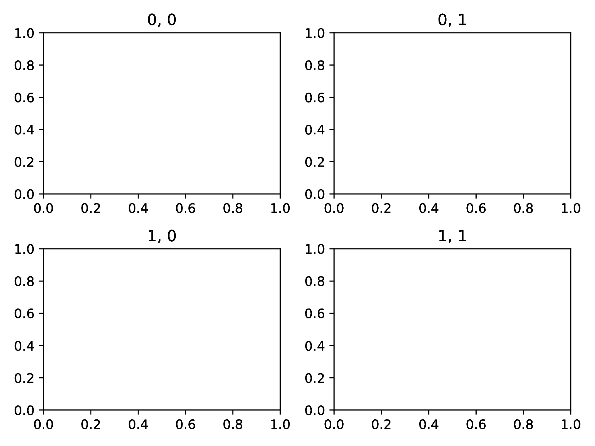

The `ax` object is made as simple as possible based on the `squeeze` parameter, where the default behavior is `squeeze = True` so that unnecessary dimensions are squeezed out of the array. By toggling `squeeze = False`, `ax` will always be made a 2D array. Setting this parameter to be false can be useful when you need to write more flexible code that can accommodate subplots of different dimensions.

### 7.2.2 Using `add_subplot`

You can avoid indexing an axes array by using the figure method `add_subplot`. The method creates an axes instance and requires specifying the subplot grid's dimensions and then the index or order within that grid. Subplots are not ordered by their row and column numbers, but by a single number. The numbering starts at 1 and increases moving to the right across the first row of graphs, and then proceeds to continue to the next row, again increases from left to right, and on and on. This is demonstrated below.

```python
fig = plt.figure()
for i in range(1,7):
    ax = fig.add_subplot(2,3,i)
    ax.text(0.5, 0.5,
            s = str(i),
            ha = 'center',
            va = 'center',
            fontsize = 30)
    ax.set_yticks([])
    ax.set_xticks([])
fig.tight_layout()
```

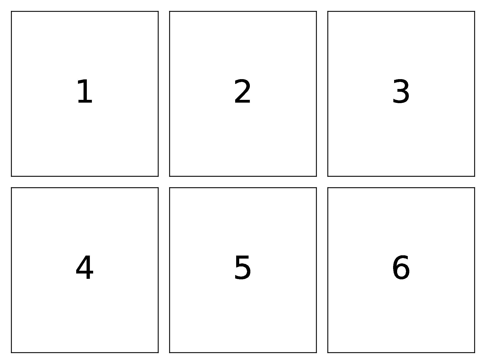

The index value can also be a tuple.

### 7.2.3 Figure Annotations and Legends

In this subsection, we concern ourselves with customizing the entire figure. Each subplot can be customized just as you might usually customize a single plot. For a figure object `fig`, the axes objects can be accessed by iterating over `fig.axes`, so that all axis limits can be changed in one loop. Figure customizations might include the spacing between plots, standardization of axes, and titling.

First, the figure method `suptitle()` is useful in creating a title that applies to the entire figure.

```python
fig = plt.figure(facecolor = 'lightgray')

for i in range(1,7):
    ax = fig.add_subplot(2,3,i)
    ax.text(0.5, 0.5,
            s = str(i),
            ha = 'center',
            va = 'center',
            fontsize = 30)
    ax.set_yticks([])
    ax.set_xticks([])
    ax.set_title("Title",
                 fontsize = 12,
                 fontname = 'Times New Roman')

fig.suptitle('SupTitle')
fig.tight_layout(rect = (0,0,1,1)) # no change
```

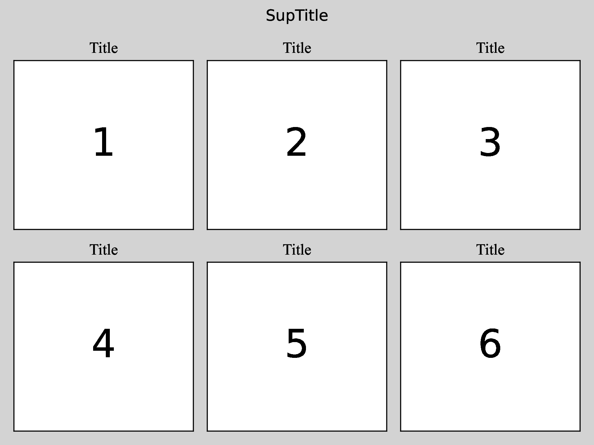

Sometimes a suptitle is cut off when saving the figure. This can be solved by changing the dimensions in `tight_layout()`. Set the `rect` argument to a 4-tuple, like `(0,0,1,.95)`. This modifies the space dedicated to the subplots, and the last value adjusts the vertical upper limit.

You can also draw lines between two different subplots with `ConnectionPatch`, a kind of *patch*. Patches will be covered more arise again in Part II, but for now it's simply a tool for use to draw a line between points on two different axes. These points are specified by parameters `xyA` and `xyB`. We specify the coordinate systems using `coordsA` and `coordsB`, making use of what we learned about transforms in Section 4.2 to specify our given coordinates are data coordinates. Then we use the `arrowstyle` parameter to create a line with arrows on both ends and the `shrinkA` and `shrinkB` parameters control how much the line will fall short of, or shrink away from the referenced point.

This code also makes use of the `transform` parameter to specify that the passed coordinates are data coordinates. See Section 4.2 for a review of transformations and other coordinate systems.

```python
from matplotlib.patches import ConnectionPatch

fig = plt.figure(figsize = (7,6))

# Generate random data
n = 100
x = np.random.normal(size = n)
y = np.random.normal(size = n)
# z is determined by x except for one outlier
z = np.concatenate([np.array([4]), 1- x[1:]**2])

# Add x,y scatter plot
ax12 = fig.add_subplot(2,2,(1,2))
ax12.scatter(x,y, alpha = 0.5)

# Add x,z scatter plot
ax3 = fig.add_subplot(2,2,3)
ax3.scatter(x,z, alpha = 0.5)

# Add y,z scatter plot
ax4 = fig.add_subplot(2,2,4)
ax4.scatter(y,z, alpha = 0.5)

# Draw lines connecting the outlier as it appears in each scatter plot
con = ConnectionPatch(
        xyA = (x[0], y[0]),
        coordsA = ax12.transData,
        xyB = (x[0], z[0]),
        coordsB = ax3.transData,
        arrowstyle = "<->",
        shrinkA = 2,
        shrinkB = 0)
fig.add_artist(con)

con = ConnectionPatch(
        xyA = (x[0],y[0]),
        coordsA = ax12.transData,
        xyB = (y[0], z[0] ),
        coordsB = ax4.transData,
        arrowstyle = "<->",
        shrinkA = 2,
        shrinkB = 0)
fig.add_artist(con)

ax12.set_xlabel("$x$")
ax12.set_ylabel("$y$")
ax3.set_ylabel("$z$")
ax3.set_xlabel("$x$")
ax4.set_ylabel("$z$")
ax4.set_xlabel("$y$")
plt.tight_layout()
```

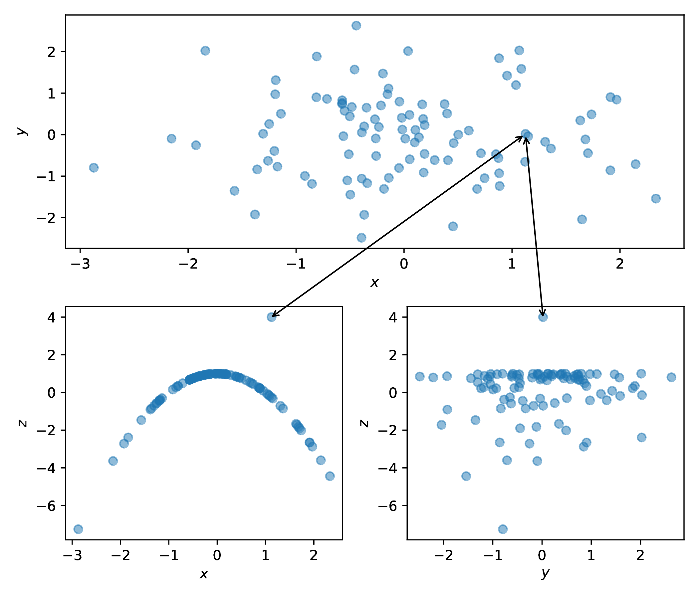

## 7.3 GridSpec

For irregular plot grids, `GridSpec` is your friend. You can specify a grid with some number of rows and columns and spacing between them. For example, `grid = plt.GridSpec(2, 3, wspace = 1, hspace = 0.3)`. Then, you can specify subplot locations using the typical slicing syntax. For example, `plt.subplot(grid[0,0])`. Or you can create an axis object for a subplot with `ax = fig.add_subplot(grid[0,0])`.

```python
import matplotlib.gridspec as gridspec

fig = plt.figure(figsize=(12,6))
spec = gridspec.GridSpec(ncols=4,
                         nrows=2,
                         figure=fig)
x = np.random.normal(0, 10, size = 300)
y = x**2 + np.random.normal(0, 100, size = 300)

ax1 = fig.add_subplot(spec[0, 0:3])
ax1.plot(x, y,
         linestyle='None',
         marker='.',
         alpha=0.5)

ax2 = fig.add_subplot(spec[0, 3:4], sharey = ax1)
ax2.hist(y, orientation='horizontal', bins=40)

ax3 = fig.add_subplot(spec[1, 0:3], sharex = ax1)
ax3.hist(x, bins = 40)
ax3.invert_yaxis()
plt.tight_layout()
```

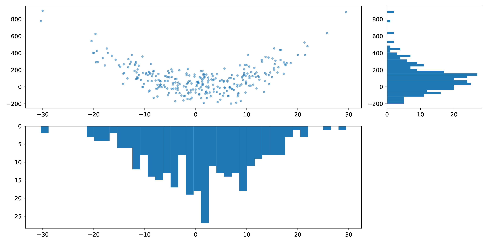