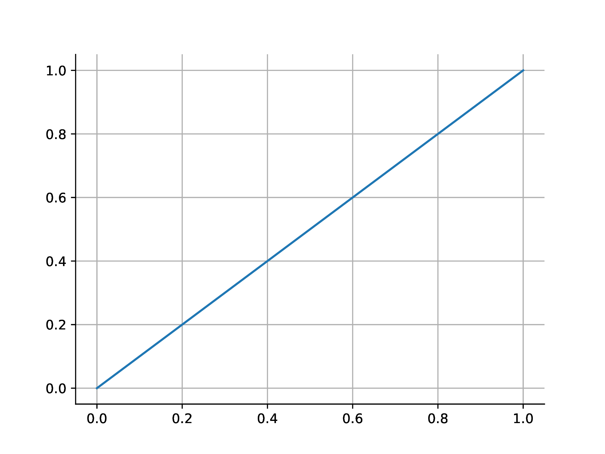
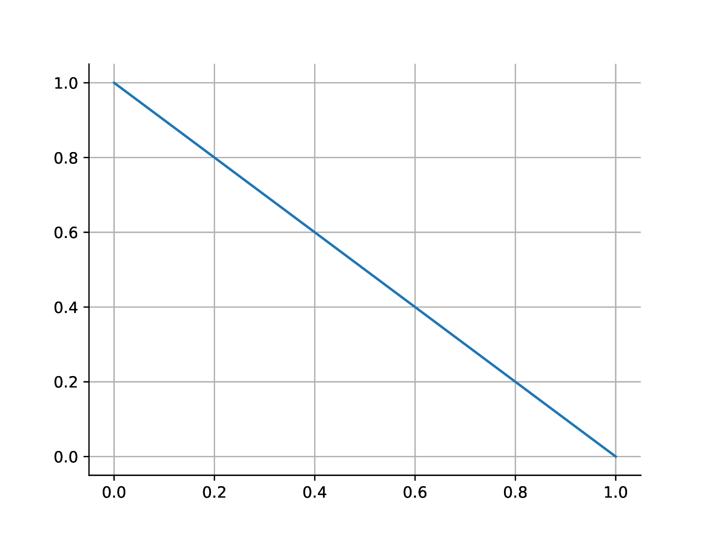
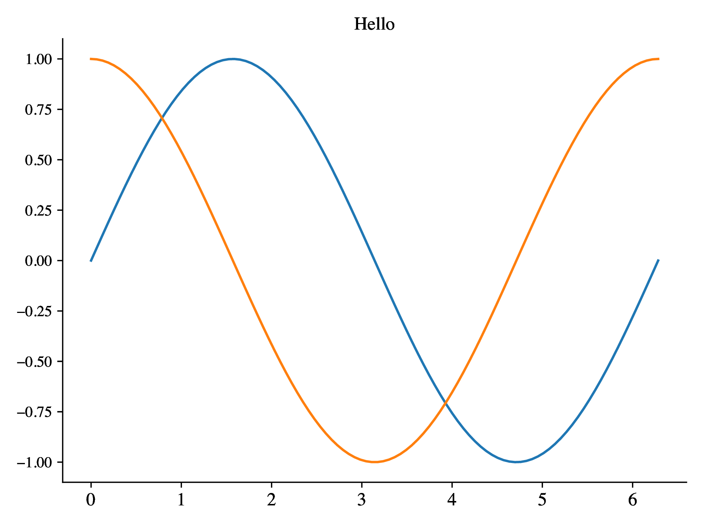
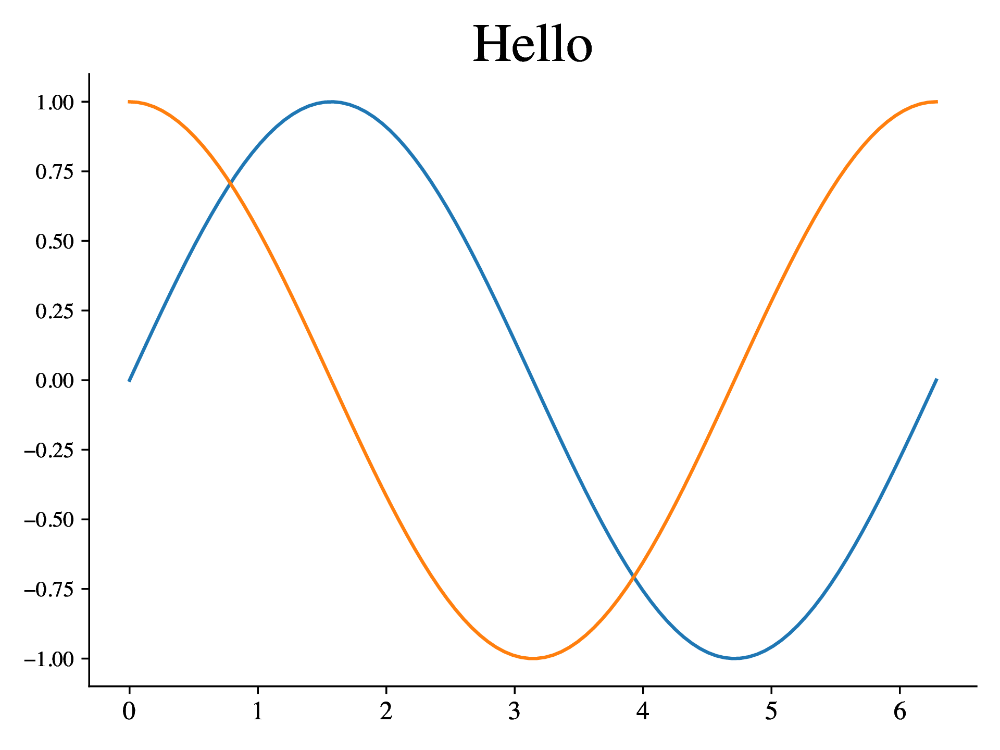
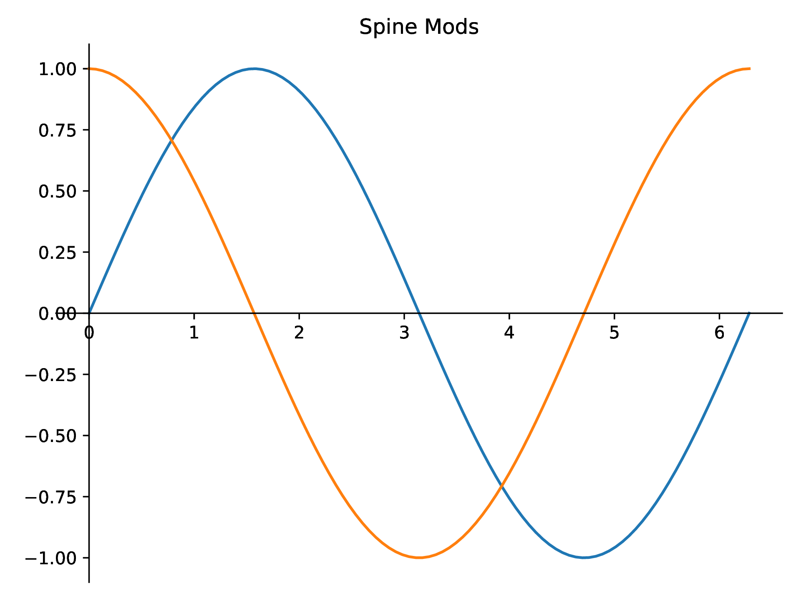
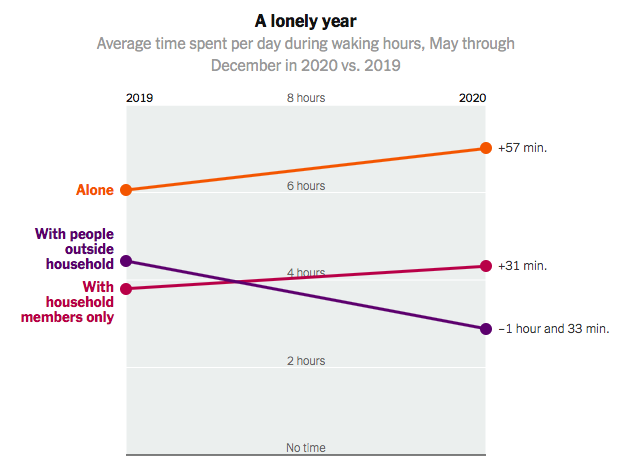
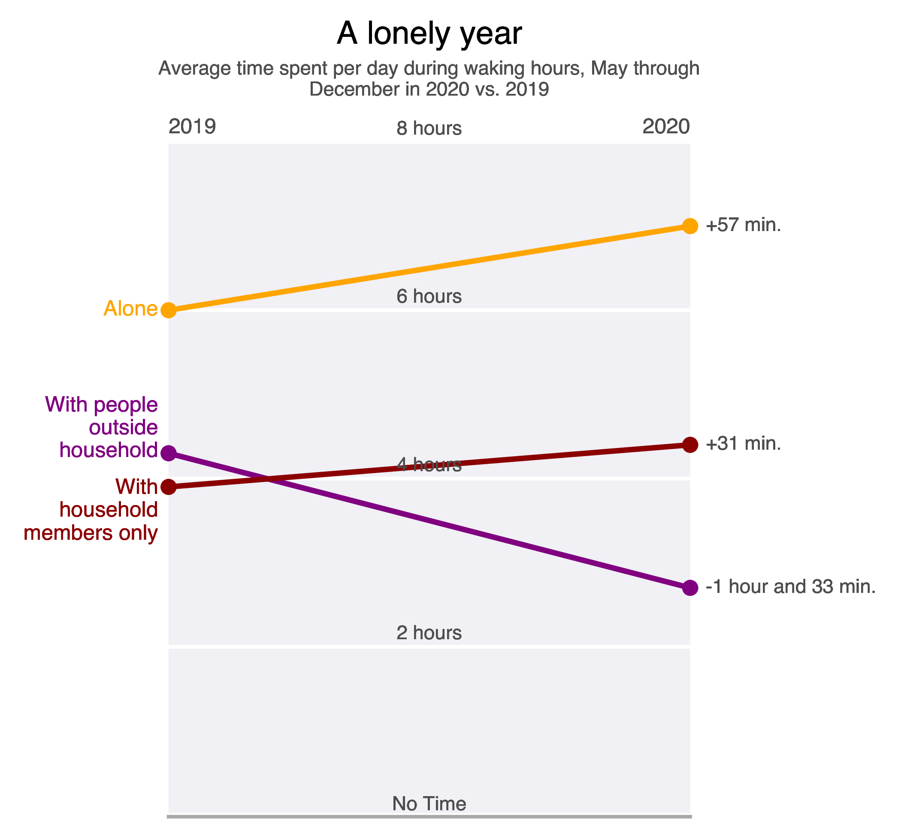
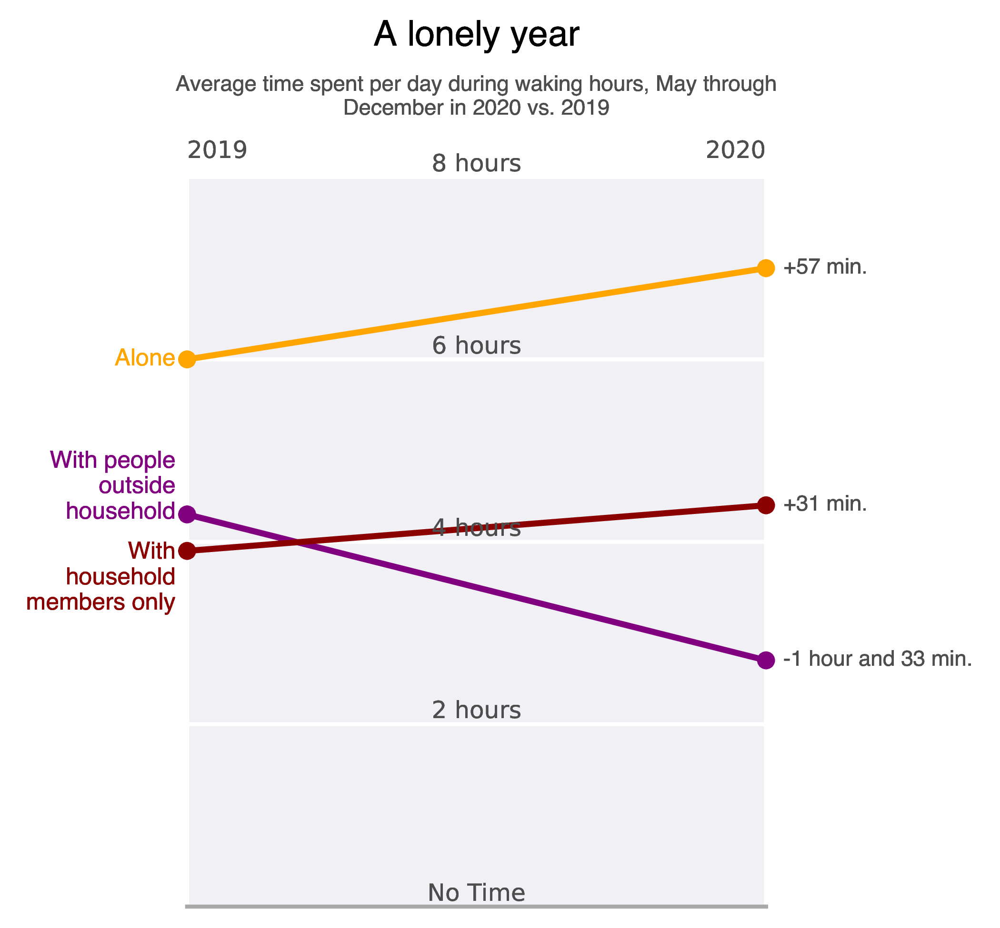

# Chapter 8: Style Configuration

This is a brief chapter that might provide a sigh of relief. So many of the parameters we have tweaked so far, sometimes laboriously, can be altered in one go with `plt.style.use`. Try out the [many style sheets already available](https://matplotlib.org/stable/gallery/style_sheets/style_sheets_reference.html). You may also define your own or simply change certain parameters directly in your code to apply that styling for your entire session.

## 8.1 rcParams

Change the matplotlib parameters directly by updating the dictionary-like variable `mpl.rcParams`. A full list of the available parameters can be found in the [documentation](https://matplotlib.org/stable/api/matplotlib_configuration_api.html#matplotlib.rcParams) or you may simply print `mpl.rcParams` to inspect it directly. Note the above line is `mpl.rcParams` and not `plt.rcParams`, because we are not working within the pyplot submodule. Accordingly, you'll have to run `import matplotlib as mpl` first. Because this is like a Python dictionary, you can adjust the settings by simply updating the dictionary value, `mpl.rcParams['axes.grid'] = True` for example.

Working with `rcParams`, directly or through a custom style sheet, provides value that compounds as you add more and more plots to your code. Consider the two programs below. Without `rcParams`, we update each plot.

```{literalinclude} ../../python/style-manual.py
:language: python
```

Now let's update `rcParams` just once for a standard style.

```{literalinclude} ../../python/style-rc.py
:language: python
```





This is a significant step, nearing us to a dramatic close of Part I. In the second program, we not only save on redundant code, we also revert back to pyplot functions. The object-oriented approach was useful in offering greater customization. But, at least in this case, that's a ladder we can kick away now that we've climbed it to the top.

## 8.2 Defining Your Own Style

Once you understand rcParams, you can define your own style for repeated use. Schwabish (2021) counsels organizations to adopt a data visualization style guide. Practically, that also means matplotlib-using organizations should choose or create a standard matplotlib style.

To define your own style, create a file with the `.mplstyle` extension, specifying a value for the various rcParams you wish to customize. Note that a colon separates the key and the default like in a dictionary, but that we do not separate key-value pairs by commas and each pair is on a separate line. Further, none of these values are formatted as strings, even though you would, for example, use a string `'Times'` when updating the font from rcParams dictionary. You only need to specify values you wish to change relative to the default.

```
# tiny-style.mplstyle
axes.spines.left : True
axes.spines.right : False
axes.spines.bottom : True
axes.spines.top : False
xtick.labelsize : large
font.family : Times
```

After saving the above as a file `tiny_style.mplstyle` and placing it in the working directory, we can use our custom style with the program below. Note the colormap, among many other things, has not changed relative to the default because we did not alter that in the style file.

```{literalinclude} ../../python/tiny-style-ex.py
:language: python
```



You can also just save direct modifications to the rcParams dictionary and run that before plotting.

```{literalinclude} ../../python/style-changes.py
:language: python
```

Then add this code to ahead of creating your plot. I saved the above as `style_changes.py` and below I use the Jupyter `%run` magic command to run `style_changes.py` without having to copy and paste.

```{literalinclude} ../../python/py-styled.py
:language: python
```

The result is



### 8.2.1 Temporary Configurations

With some creativity, you can also avoid modifying rcParams by defining a function or writing a Python file that makes certain standardized plot modifications and then run that after you've created your figure and axes objects, using the IPython `%run` magic command.

We save the following as `spine-mod.py` and then use it below to modify a plot.

```{literalinclude} ../../python/spine-mod.py
:language: python
```

```{literalinclude} ../../python/spine-mod-ex.py
:language: python
```



In the plot program, we use pyplot functions instead of using the OOP approach. Note that even if we created an `ax` variable, we must still use `plt.gca()` instead of `ax` in the file, because there is no `ax` to reference in `spine_mod.py`. We can instead use `%run -i` to let the file access our global variables. Also, `%run -i` eliminates the need to import matplotlib again—we could delete the import statement from `spine-mod.py` and use `%run -i spine-mod.py`.

We save the following file as `spine-mod2.py` and can create the same plot with the program further below.

```{literalinclude} ../../python/spine-mod2.py
:language: python
```

```{literalinclude} ../../python/spine-mod2-ex.py
:language: python
```


A further complication arises if our figure contains multiple subplots. In this case, we can access all the axes objects as an attribute of the figure object.

```python
for ax in fig.axes:
    ax.spines['left'].set_position('zero')
    ax.spines['bottom'].set_position('zero')
    ax.spines['top'].set_visible(False)
    ax.spines['right'].set_visible(False)
```

## 8.3 A Final Prose Example

In this section, we'll integrate much of what we've learned so far to create a line chart that, though simple, is far from the default. We'll imitate a chart from the New York Times article, *The Pandemic Changed How We Spent Our Time*, by Ben Casselman and Ella Koeze. Below is the original.



Imitating this graphic will take a lot of code, as demonstrated in Section 8.3.1. In Section 8.3.2, we invest in reconfiguring the style and creating functions that help reduce the tedium that would otherwise be required to make several plots of this style.

### 8.3.1 A First Go

The program below would be even longer if not for the use of dictionaries like `plot_style`, which pairs keyword arguments and specific values for the `plot()` method. This can be passed to `plot()` after being unpacked with the `**` operator.

```{literalinclude} ../../python/nyt-rep1.py
:language: python
```



### 8.3.2 Reconfigured, Refactored, and Reusable

```
# nyt-helper.mplstyle
axes.linewidth: 2
axes.facecolor: (.94, .94, .96)
axes.grid.axis: y
axes.grid: True
grid.color: white
grid.linewidth: 2
axes.spines.bottom: True
axes.spines.top: False
axes.spines.left: False
axes.spines.right: False
axes.edgecolor: darkgray
xtick.bottom: False
xtick.top: False
ytick.left: False
xtick.labeltop: True
xtick.labelbottom : False
ytick.labelleft: False
xtick.color: (.3,.3,.3)
text.color: (.3,.3,.3)
font.size: 12
lines.marker: o
lines.markersize: 8
lines.linewidth: 3
axes.titlesize: 18
axes.titleweight: bold
axes.formatter.useoffset: False
```

```{literalinclude} ../../python/nyt-helper-data.py
:language: python
```

```{literalinclude} ../../python/nyt-helper-data.py
:language: python
:lines: 1-6
```

```{literalinclude} ../../python/nyt-refactor.py
:language: python
```

